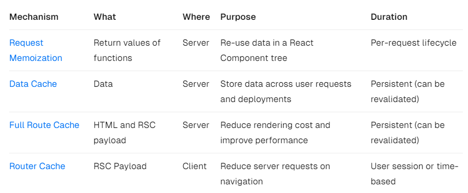
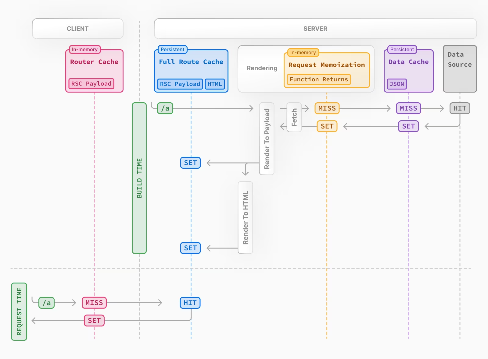
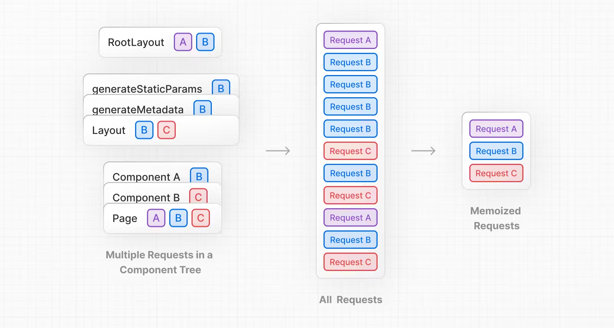
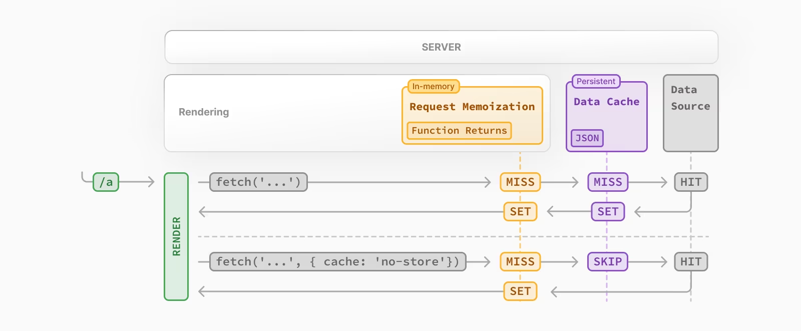
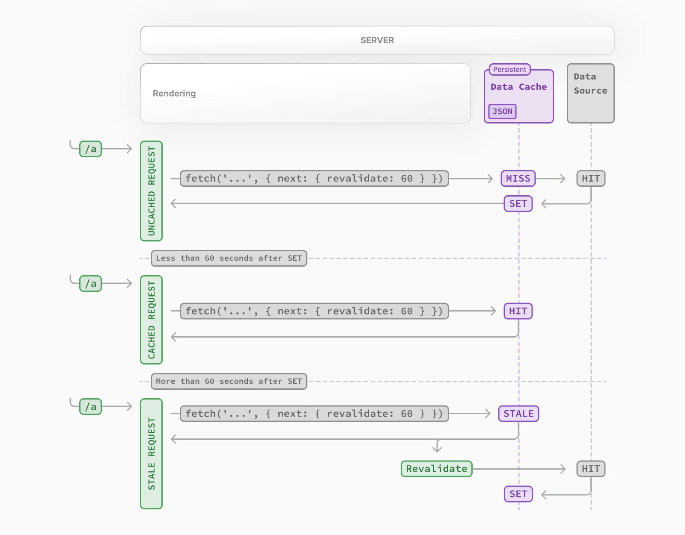
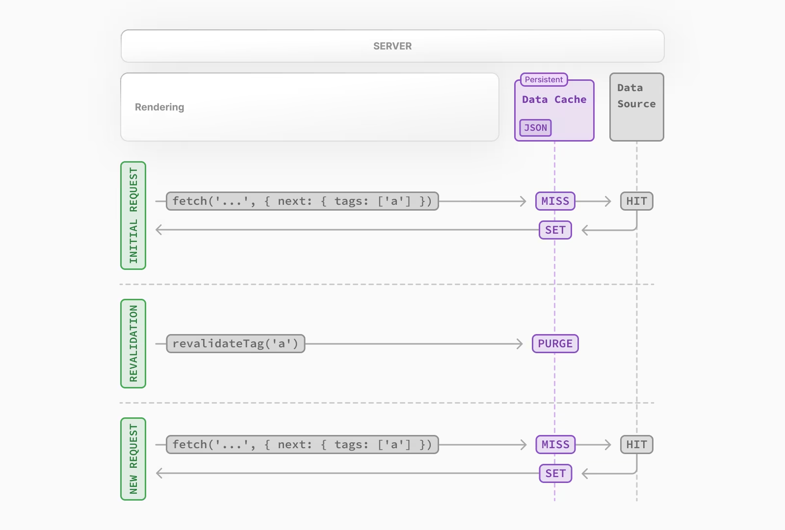

# Next.js의 Caching

Next.js는 렌더링 작업과 데이터 요청을 캐싱하여 성능을 향상시키고 비용을 절감한다. 4가지 캐시 매커니즘이 존재한다.

## ☪️ 매커니즘



### 1. 사용자가 새로운 요청을 발생시킬 경우

> `Router Cache` 에서 캐시된 데이터 서치

**Router Cache는 클라이언트 측**에 존재하며 사용자가 내비게이션할 때 서버 요청을 줄이기 위해 RSC 페이로드를 캐시한다.

사용자가 특정 경로로 이동하거나 페이지를 요청할 때, Next.js는 가장 먼저 `Router Cahce` 에서 해당 요청에 대한 캐싱이 존재하는지 검색한다.

1. HIT >>> 라우터 캐시에서 해당 데이터를 리턴
2. MISS >>> 서버에서 요청에 대한 데이터를 가져온 후 캐시에 `SET` 저장한다. 이후 같은 요청은 HIT

### 2. 사용자의 요청을 서버로 전송할 경우

위에서 MISS일 경우 그 다음 단계이다. 서버는 클라이언트로부터 요청을 받으면 해당 요청에 대한 데이터를 가져오기 전 `Request Memoization` 을 확인한다.

> Request Memoization은 서버 측에서 *함수의 리턴 값을 캐싱*해 **동일한 요청에 대해 계산된 결과를 재사용**하는 매커니즘이다.

1. HIT >>> 즉시 리턴
2. MISS >>> 서버는 해당 요청을 처리해 필요한 데이터를 가져온다. 이 때 SET되므로 같은 요청은 이후 HIT

### 3. 데이터를 요청할 경우

위에서 MISS일 경우 해당 요청을 처리해 데이터를 가져와야 한다. 이 때 `Data Cache` 를 먼저 확인한다.

> Data Cache는 서버에서 사용자 요청 및 배포 전반에 걸쳐 데이터를 저장한다.

1. HIT >>> 즉시 리턴
2. MISS >>> 데이터 소스(데이터베이스, 외부 API 등)에서 데이터를 요청한다.

### 4. 모든 캐시에 데이터가 존재하지 않을 경우

모든 과정에서 캐시를 사용하지 못하면 `Data Source` 에서 데이터를 직접 조회한다.

조회된 데이터는 요청의 역순을 따라 반환된다. 즉 데이터는 먼저 데이터 캐시에 저장되고, Request Memoization 캐시에 저장된 후, 최종적으로 클라이언트로 반환된다.

+. Next.js의 캐싱 매커니즘은 클라이언트와 서버 양쪽에 데이터를 저장해 성능 최적화와 안정성을 제공한다.



## ☪️ Request Memoization

Next.js의 Request Memoization 기능은 리액트의 fetch API를 확장하여 **동일한 URL과 옵션을 가진 요청을 자동으로 메모이징**하는 기능을 제공한다. 동일한 데이터를 여러 곳에서 사용하는 경우, 한 번만 네트워크 요청을 보내고 그 결과를 캐시에 저장해 이후 동일한 요청이 있을 때 캐시에서 바로 리턴한다.



### 작동원리

1. 자동 메모이징 : 동일한 URL과 옵션으로 fetch 함수가 호출되면 자동으로 메모이징
2. 단일 실행 : 동일한 데이터를 여러 컴포넌트에서 사용할 경우 fetch 함수는 **한 번만 실행**된다.

   **Deduplicated Fetch Requests**

   컴포넌트 트리 내 중복 요청을 제거한다. 여러 컴포넌트에서 같은 데이터 요청=fetch할 경우에도 네트워크 요청은 한 번!만 발생한다.

   하나의 렌더링 과정에 동일한 데이터 요청=fetch는 자동 메모이징된다.

```tsx
export default function HomePage() {
  return (
    <Layout>
      <h1>Home Page</h1>
      <ItemSummary />
      <ItemDetails />
    </Layout>
  );
}

// components/ItemSummary.js
import React, { useEffect, useState } from "react";
import { getItem } from "../lib/api";

export default function ItemSummary() {
  const [item, setItem] = useState(null);

  useEffect(() => {
    async function fetchData() {
      const data = await getItem();
      setItem(data);
    }
    fetchData();
  }, []);

  if (!item) return <div>Loading...</div>;

  return (
    <div>
      <h2>Item Summary</h2>
      <p>ID: {item.id}</p>
      <p>Name: {item.name}</p>
    </div>
  );
}

// components/ItemDetails.js
import React, { useEffect, useState } from "react";
import { getItem } from "../lib/api";

export default function ItemDetails() {
  const [item, setItem] = useState(null);

  useEffect(() => {
    async function fetchData() {
      const data = await getItem();
      setItem(data);
    }
    fetchData();
  }, []);

  if (!item) return <div>Loading...</div>;

  return (
    <div>
      <h2>Item Details</h2>
      <p>ID: {item.id}</p>
      <p>Name: {item.name}</p>
      <p>Description: {item.description}</p>
    </div>
  );
}

// lib/api.js
let requestCount = 0;
export async function getItem() {
  // 요청이 실행될 때마다 로그를 출력
  console.log(`Fetching data... (Request count: ${++requestCount})`);
  // Fetching data... (Request count: 1)
  const res = await fetch("https://api.example.com/item/1");
  if (!res.ok) {
    throw new Error("Failed to fetch data");
  }
  return res.json();
}
```

1. HomePage 컴포넌트가 렌더링되면서 ItemSummary와 ItemDetails 컴포넌트가 함께 렌더링된다.
2. ItemSummary 컴포넌트가 최초 렌더링될 때 useEffect 훅이 실행되며 getItem 함수로 데이터 요청한다.
   1. 해당 결과는 메모이제이션되어 메모리에 저장된다.
3. ItemDetails 컴포넌트가 렌더링될 때 마찬가지로 getItem 함수를 호출하는데 이 때 캐시의 데이터를 가져온다.
   1. 콘솔을 확인해보면 한 번만 요청됨

### 추가

- 메모 요청은 리액트의 기능이다.
- [\*\*Opting out](https://nextjs.org/docs/app/building-your-application/caching#opting-out) :\*\* 메모 요청은 fetch 메소드에만 적용되며 GET 요청에서만 작동한다.

> 메모 요청 캐시는 서버 요청의 수명 시간 동안 유지된다. 즉 서버를 다시 시작하지 않는 한 캐시가 유지된다. 따라서 Revalidation 재검증이 필요없다.

---

## ☪️ Data Cache

Next.js는 서버 사이드 요청에서 데이터 캐시를 활용한다. 이 때 데이터 캐시는 초기화하지 않는 이상 영구적이다.

> 메모 요청과 데이터 캐시 구분?

- 데이터 캐시는 서버 사이드 요청에서 발생하는 데이터 요청의 결과를 영구적 저장. 메모 요청은 리액트 컴포넌트 트리에서 동일한 요청을 메모리에 저장해 동일한 요청 또 발생하면 메모리에서 바로 리턴한다. 메모 요청은 리액트 컴포넌트 트리의 렌더링 중에만 적용(==리액트가 화면을 그리는 과정 중에만 적용)되며 각 컴포넌트의 인스턴스 메모리에 캐시가 저장된다. 데이터 캐시는 서버 전체의 데이터를 저장한다.
  >



첫 번째 요청이 렌더링 중에 발생할 때 메모 요청의 캐시에 없으면 데이터 소스에 요청이 만들어지고 결과가 데이터 캐시에 저장된다.

`메모 요청` 과 `데이터 캐시` 의 차이는 데이터 캐시는 영속적으로 유지되고 메모는 요청의 수명 동안만 지속된다.

### 영구적인 데이터 캐시를 업데이트해야 할 때

적절한 데이터 캐시 무력화 기법이 필요하다. 4가지 방법

Revalidation 재검증은 캐시된 데이터를 다시 검사해 새로운 데이터로 갱신하는 과정이다.

1. cache: no-store
2. Time-based Revalidation : revalidate
3. On-demand Revalidation : revalidatePath
4. On-demand Revalidation : revalidateTag

```tsx
async function fetchDataWithoutCache() {
  const response = await fetch("http://localhost:4000/posts", {
    cache: "no-store",
  });
  // 요청마다 캐시를 사용하지 않음 > 성능저하
  const data = await response.json();
  console.log(data);
}

fetchDataWithoutCache();
```

.

```tsx
const response = await fetch("http://localhost:4000/posts", {
  next: { revalidate: 10 },
});
// 10초 동안 캐시된 데이터를 사용하고 이후에는 다시 요청
```



1. 첫번째 요청은 캐시에 없기 때문에 MISS가 되고 데이터 소스에 요청하고 결과 받아 SET한다.
2. 두번째 요청은 60초가 지나기 전이였으므로 캐시를 사용할 수 있다.
3. 세번째 요청은 60초가 지났다. 그런데 MISS가 아니라 `STALE` 라는 상태가 되는데 이 상태는 해당 API 콜이 더 이상 유효하지 않다는 것이다. 저장된 캐시가 STALE 상태로 내부적으로 캐시가 무효화되고 STALE 상태에서 SET 해줘서 **그 다음 접근**부터 HIT이 된다.

   > 즉 시간이 지나도 한 번은 캐시된 데이터를 돌려받는다. 그 다음 새로고침부터는 HIT.

**On-demand Revalidation**

3번째 방법 revalidatePath("/"). **경로에 따라 필요할 때 데이터를 다시 검증한다.** 특정 경로에 대한 요청이 있을 때마다 해당 경로의 데이터를 다시 가져와 업데이트한다. 초기화해야 할 경로를 직접 입력해야 하는 단점이 있다.

4번째 방법 revalidateTag는 캐시 **태그에 따라 필요할 때 데이터를 다시 검증**한다. 특정 태그가 지정된 데이터가 변경되면 해당 태그가 지정된 모든 데이터가 다시 검증된다. 관련된 여러 데이터가 변경되었을 때 처리하는데 유용하다.



1. 첫번째 요청시 데이터는 외부 데이터 소스에서 가져와 데이터 캐시에 저장
2. On-demand Revalidation이 트리거되면(경로나 태그가 맞으면), 해당 캐시 항목이 캐시에서 제거됨(PURGE:캐시에서 완전 제거)
   1. 이는 Time-based Revalidation 시간 기반 재검증과 다르다. 시간 시반은 새로운 데이터 가져올 때까지 캐시된 데이터를 유지한다.
3. 다음 요청시 다시 캐시 MISS가 되고 데이터는 외부 데이터 소스에서 가져와 데이터 캐시에 다시 저장된다.

```tsx
const posts = await(
  await fetch("http://localhost:4000/posts", { next: { tags: ["posts"] } })
).json();
```

클라이언트 코드로 tags 옵션으로 데이터의 태그를 지정해서 요청한다.

```tsx
"use server";
import { revalidatePath, revalidateTag } from "next/cache";

export async function clickHandler() {
  //   revalidatePath("/");
  revalidateTag("posts");
}
```

서버 코드로 데이터의 태그나 경로를 확인해 데이터 캐시의 재검증을 수행한다.
