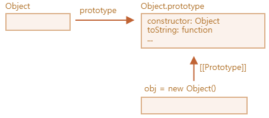

# 프로젝트 캠프 3일차

:::note[REVIEW]
오늘은 샤브샤브를 먹었다.
html, css 공부를 더 해야할듯
:::

## 복습 🍒

## 10. 생성자 함수 🍒

생성자 함수는 관습적으로 첫 글자를 대문자로 시작한다. `new` 키워드를 사용하면 this = {}, return this를 실행한다. 속성 추가는 this.attribute = tmp; 이런 식으로 **this 키워드를 사용**해 객체의 속성 값을 정의한다.

`인스턴스`란 특정 클래스 또는 생성자 함수로부터 만들어진 객체를 의미한다. 이를 확인하기 위해서는 **`instanceof`** 연산자를 사용할 수 있다. 객체 중에 인스턴스가 존재한다.



### 🔲 프로토타입 속성

모든 자바스크립트 함수는 `prototype` 이라는 기본 속성을 가진다. 해당 속성은 함수가 생성자로 사용될 때 객체를 생성할 수 있는 함수=**생성자 함수에만 존재**한다. 이 `prototype` 속성은 함수가 생성자로 사용될 때 새로 생성된 객체의 프로토타입을 지정한다.

ㅤ

프로토타입 히든 속성은 함수에만 존재한다. 함수만! 여기에는 constructor라는 속성이 있는데 해당 속성에는 이 함수를 생성자로 가지고 있는 상위 함수를 가진다.

끝까지 프토로타입을 따라가면(\_\_prototype\_\_) 가장 상위에는 construcor : f Object 생성자가 있다. 해당 생성자에는 이미 자바스크립트가 생성해둔 다양한 함수등이 존재한다.


프로토타입 객체에는 constructor 속성과 \_\_proto\_\_ 속성 두 개를 기본으로 가진다.

프로토 속성으로 더 상위의 생성자 함수==현재 객체를 만든 생성자 함수로의 접근 권한을 얻을 수 있다.

[참고링크](https://developer.mozilla.org/en-US/docs/Learn/JavaScript/Objects/Object_prototypes)


this는 자신을 호출한 객체의 영향 받음

```jsx
// 생성자 함수 정의
function A(a, b) {
  this.a = a;
  this.b = b;
}

// 프로토타입에 메서드 추가
A.prototype.sum = function () {
  return this.a + this.b;
};

// A의 인스턴스 생성, a와 b 값을 초기화하지 않음
let instance1 = new A(1, 2);

console.log(instance1.sum()); // 3
console.log(instance1.__proto__.sum()); // NaN
console.log(A.prototype.sum()); // NaN
```

`A.prototype`와 `instance1.__proto__`는 사실상 동일한 객체를 참조합니다. 이는 자바스크립트의 프로토타입 체인 구조 때문

```jsx
// 프로토타입 체인 구조
instance1 --.__proto__--> A.prototype
```

ㅤㅤ

## 11. 프로토타입 🍒

생성자 함수는 프로토타입 객체가 존재한다. 프로토타입 객체는 생성자 함수의 prototype 속성으로 접근해 확인 가능하다. 생성자 함수로 만들어낸 객체에는 \_\_proto\_\_ 속성으로 접근해 확인 가능하다.

```jsx
console.log(animal1.__proto__ == animal2.__proto__); // true;
console.log(animal1.__proto__ === animal2.__proto__); // true;
```

같은 생성자로 생성한 2개의 객체는 같지 않지만 프로토타입은 같다. 이를 이용해 생성자 함수를 업데이트 가능하다.

```jsx
animal1.__proto__.getName = function () {
  return `이름은 ${this.animalName}입니다.`;
};
console.log(animal1.getName()); // 이름은 곰입니다.
console.log(animal2.getName()); // 이름은 곰입니다.
```

프로토타입 객체가 수정되면 이전에 생성된 객체들의 속성도 변한다. 이는 자바스크립트의 `프로토타입 체인` 때문이다. 체인은 객체가 특정 속성이나 메서드를 찾을 때 자신의 프로토타입을 통해 탐색하기 때문에 프로토타입이 수정되면 해당 프로토타입을 공유하는 모든 객체가 영향받는다.

```jsx
function Animal(name) {
  this.animalName = name;
}

const animal1 = new Animal("곰");
const animal2 = new Animal("사자");

// 프로토타입에 메서드 추가
animal1.__proto__.getName = function () {
  return `이름은 ${this.animalName}입니다.`;
};

console.log(animal1.getName()); // 이름은 곰입니다.
console.log(animal2.getName()); // 이름은 사자입니다.
// 이후에 추가된 함수를 이전에 생성된 객체에서도 사용 가능하다.
```

ㅤ

### 동물병원 진료기록 로직

### 🔲 **옵셔널 체이닝 (Optional Chaining)**

옵셔널 체이닝 `?.`은 객체 속성 접근이나 메서드 호출을 할 때, 해당 경로가 존재하지 않으면 `undefined`를 반환합니다. 이를 통해 코드가 중첩된 객체 경로에서 발생할 수 있는 에러를 방지할 수 있습니다.

```jsx
this.animalName = params?.animalName ? params.animalName : "no-data";
this.animalName = params?.animalName ?? "no-data";
```

두 번 쓰이는 건 `null` 또는 `undefined` 인 경우 처리하기 위해서이다. ??로 줄일 수도 있다.

```jsx
this.getCurrentTime = function () {
  const date = new Date();
  return `${date.getFullYear()}.${
    date.getMonth() + 1 < 10 ? "0" + (date.getMonth() + 1) : date.getMonth() + 1
  }.${
    date.getDate() < 10 ? "0" + date.getDate() : date.getDate()
  } ${date.getHours()}:${date.getMinutes()}:${date.getSeconds()}`;
};

//이해예시
let currentTime = getCurrentTime();
console.log(currentTime); // 예: "2023.05.28 14:23:45"
```

`getMonth` 는 0부터 시작하므로 입력한 월에 +1을 한다. 10보다 작으면 0을 붙여서 02월 이런식으로 보일 수 있도록 한다.

```jsx
date.getMonth() + 1 < 10 ? "0" + (date.getMonth() + 1) : date.getMonth() + 1;
```

ㅤ

## +. 자바스크립트에서의 상속

### 🔲 call 함수

**`call()`** 함수는 함수를 호출하면서 특정 객체를 함수 내에서 `this`로 사용할 수 있도록 하는 메서드입니다. **`call()`** 메서드는 기본적으로 함수 객체의 메서드로 사용되며, 첫 번째 매개변수로는 함수 내에서 사용할 **`this`** 객체를 전달받고, 이후의 매개변수는 호출할 함수에 전달됩니다.

```jsx
function Animal(name, sound) {
    this.name = name;
    this.sound = sound;
    this.makeSound(){
	    console.log(`${this.name} makes a sound: ${this.sound}`);
}

function Dog(name, sound, breed) {
    Animal.call(this, name, sound); // Animal 생성자 호출
    this.breed = breed;
}

Dog.prototype = Object.create(Animal.prototype); // 상속 설정
Dog.prototype.constructor = Cat; // 생성자 지정

const dog = new Dog("Buddy", "Woof!", "Golden Retriever");

dog.makeSound(); // 출력: Buddy makes a sound: Woof!

```

> ES6부터는 클래스 개념 추가로 위처럼 코드작성XXX

### 🔲 클래스 ⭐

`extends` 키워드를 사용해 클래스를 상속하고, `constructor` 메서드를 사용해 객체를 초기화한다. _생성자 함수(constructor) 반드시 포함한다._ `super` 를 사용해 부모 클래스의 생성자를 호출해 상속받은 속성을 초기화할 수 있다.

```jsx
class Animal {
  constructor(name) {
    this.name = name;
    console.log(`${this.name} animal`);
  }
  makeSound() {
    console.log(`${this.name} makes a sound`);
  }
}
class Dog extends Animal {
  constructor(name, breed) {
    // console.log(`${this.name} dog1`);
    // ReferenceError: Must call super constructor in derived class before accessing 'this'
    super(name); // 부모 클래스의 생성자 호출
    console.log(`${this.name} dog2`);
    this.breed = breed;
  }
  bark() {
    console.log(`${this.name} barks`);
  }
}
const myDog = new Dog("Buddy", "Golden Retriever");
myDog.makeSound(); // 출력: Buddy makes a sound
myDog.bark(); // 출력: Buddy barks

/*출력
Buddy animal
Buddy dog2
Buddy makes a sound
Buddy barks
*/
```

**ReferenceError: Must call super constructor in derived class before accessing 'this'**

> `super()`를 호출하기 전에 `this`를 참조하거나 생성자에서 반환하는 것을 금지한다.

- extends를 사용해 상속을 하면 반드시 `super` 를 사용해 부모의 생성자를 호출해야 한다.
- super 전에 this를 사용하면 부모 클래스의 생성자가 호출되기 전에 *자식 클래스의 인스턴스가 초기화*되기 때문에 정의되지 않은 상태로 this를 참조하게 되어 에러가 발생한다.
  - 생성자 내에서 `this`는 생성되고 있는 인스턴스를 가리키지만, 생성자가 호출되기 전에는 해당 인스턴스가 완전히 초기화되지 않은 상태일 수 있습니다.

### 🔲 getter setter

`set` 은 set 키워드 뒤에 클래스 생성자에서 사용하는 변수로 이름짓는다. `set` 키워드가 추가되면 이후 speed 값의 세팅=할당에는 무조건 set이 관여한다.

```jsx
class Car {
  constructor(speed) {
    this.speed = speed;
  }
  getSpeed() {
    return this.speed;
  }
  set speed(value) {
    this.speed = value;
  }
}
const car1 = new Car(-100);
console.log(car1.getSpeed());

// RangeError: Maximum call stack size exceeded
```

speed에 \_를 붙여 게터, 세터 변경하면 에러나지 않는다. 다른 것도 되는데 관례상 언더바로 사용한다. 클래스의 speed는 이제 \_speed가 된다.

```jsx
class Car {
  constructor(speed) {
    this.speed = speed;
  }
  getSpeed() {
    return this._speed;
  }
  set speed(value) {
    this._speed = value < 0 ? 0 : value;
  }
}
const car1 = new Car(-100);
console.log(car1.getSpeed());
console.dir(car1);
// 0
// Car { speed123: 0 }
```

P. 문제는 이럴 경우 기존 `this.speed` 참조가 불가능하고 코드를 수정해야 한다. 그래서 나온 것이 `get` 이다. 게터를 사용하면 *기존 코드의 수정 없이 속성 값을 설정하고 읽기 가능*하다.

```jsx
class Car {
  constructor(speed) {
    this.speed = speed;
  }
  getSpeed() {
    return this.speed;
  }
  set speed(value) {
    this._speed = value < 0 ? 0 : value;
  }
  get speed() {
    return this._speed;
  }
}
const car1 = new Car(-100);
console.log(car1.getSpeed());
console.dir(car1);
```

**P. 외부에서 해당 속성에 접근해 바꾸려는 시도를 할 때**

sol ) 비공개 속성 만들기 : #speed를 클래스 아래 선언하면 private으로 선언된다. speed는 더이상 외부에서 바로 보거나 접근, 변경할 수 없고 `get` 을 사용해 읽기 가능하고 `set` 을 이용해 변경 가능하다.

```jsx
class Car {
  #speed; // private, 2020 최신문법

  constructor(speed) {
    this.#speed = speed;
  }

  getSpeed() {
    return this.#speed;
  }

  setSpeed(value) {
    this.#speed = value < 0 ? 0 : value;
  }
}

const car1 = new Car(-100);
console.log(car1.getSpeed()); // 출력: 0
car1.setSpeed(150);
console.log(car1.getSpeed()); // 출력: 150
console.dir(car1); // #speed 비공개 속성은 콘솔에서 보이지 않습니다.
// SyntaxError: Private field '#speed' must be declared in an enclosing class
```

### 🔲 static

`static` 키워드를 사용해 정의된 속성이나 메서드는 클래스 자체에 속하며, 인스턴스가 아닌 클래스 이름을 통해 접근할 수 있다. 이는 클래스의 인스턴스마다 동일한 값을 공유하거나 공통적으로 사용할 수 있는 기능을 정의할 때 유용하다. 정적

- _클래스 이름을 통해 직접 접근해야 합니다._

```jsx
class MathUtils {
  static APP_NAME = "Math Utils";

  constructor(number) {
    this.number = number;
  }
  static add(a) {
    return ++a;
  }
}
const mathInstance = new MathUtils(10);
console.log(MathUtils.APP_NAME); // Math Utils
console.log(mathInstance.APP_NAME); // undefined
console.log(MathUtils.add(10)); // 11
```

ㅤ

### 🔲오버라이딩

오버라이딩된 메서드를 통해 자식 클래스는 부모 클래스의 메서드를 덮어쓸 수 있으며, 자식 클래스에서 메서드를 재정의해 사용할 수 있다.

```jsx
// 오버라이딩
class Shape {
  constructor(color) {
    this.color = color;
  }
  getColor() {
    return `도형은 ${this.color} 색입니다.`;
  }
}
class Rectangle extends Shape {
  constructor(color, width, height) {
    super(color);
    this.width = width;
    this.height = height;
  }
  getColor() {
    // 부모 클래스의 메서드를 오버라이딩
    return `사각형은 ${this.color} 색입니다.`;
  }
}
const shape1 = new Shape("blue");
console.log(shape1.getColor()); // 도형은 blue 색입니다.

const rectangle1 = new Rectangle("red", 5, 10);
console.log(rectangle1.getColor()); // 사각형은 red 색입니다.
```

## 12. 표준 내장 객체 🍒

## +. 래퍼 객체

자바스크립트는 기본 자료형을 객체로 다루기 위해 `래퍼 객체`를 제공한다. (number, string boolean 가능)

기본 자료형을 상응하는 상위 객체로 감싼다 == 래핑.

기본 자료형은 객체가 아니라 속성과 메소드를 가질 수 없다. 일시적으로 래퍼 객체로 변환한다.

```jsx
let num = 42.3435; // 기본 자료형 숫자
console.log(typeof num); // 출력: number

let numObj = new Number(num); // 숫자 래퍼 객체로 래핑
console.log(typeof numObj); // 출력: object

console.log(numObj.toFixed(2)); // 출력: 42.34
console.log(num == numObj); // true
console.log(num === numObj); // false
```

### ? 리터럴 표기법이란 ?

사실 모든 자료형 (기본, 참조)는 표준 내장 객체이다. 즉 new 키워드(생성자 함수)를 이용해 생성 가능한데 단순하게 리터럴 표기법을 사용해 표기할 수 있다.

```jsx
let numLiteral = 42; // 리터럴 표기법
let numConstructor = new Number(42);
```

ㅤ

## 13. 배열 내장 객체 🍒

```jsx
.push()
.shift() // 배열 제일 앞 제거, 0 idx 제거
.unshift(value) // 제일 앞에 값 추가
.join([separator]) // 인자로 배열 합치기
.sort() // 객체도 정렬 가
.reverse()
```

파괴적 메서드 : 원본을 변형시키는 메서드. 메서드 사용 후 재할당할 필요가 없다.

```jsx
const num = [1, 2, 3];
num.push(4);
// num2 = num.push(4);
```

비파괴적 메서드

## 14. 문자 내장 객체 🍒

```jsx
.split([separator[,limit]])
.charAt(index) // idx 위치의 값 가져오기
.concat(str1, str2, str3, [,..., strN])
.indexOf(searchValue[, fromIndex]) // 일치하는 첫번째 idx 리턴
.includes(searchValue[, position]) // bool 리턴
.slice(beginIndex[,endIndex])
```

## 15. Math 객체 🍒

```jsx
Math.min(val1, val2, val3, val4); // min값 리턴
Math.max();
Math.random();
Math.random() * (max - min) + min;
Math.round(); // 소수점 반올림
Math.floor(); // 소수점 내림
Math.ceil(); // 소수점 올림
Math.abs(); // 절대값 리턴
Math.pow(x, y); // 거듭제
```

ㅤ

## **22. 클로저 🍒**

> **함수 실행 컨텍스트가 종료 되지 않는 코드적 특징**
> 문법이 아닌 일종의 형상

자바스크립트의 `클로저`는 **내부 함수가 외부 함수의 변수에 접근할 수 있는 기능**을 의미합니다. `클로저`는 내부 함수가 *자신이 선언된 환경(외부 함수)의 변수들을 기억*하고, 함수 실행 컨텍스트가 종료된 후에도 그 변수들에 **접근**할 수 있게 해줍니다.

ㅤ

자유변수는 내부 함수에서 참조하지만 자신 내부 또는 매개 변수로 정의되지 않은 변수이다. 클로저를 사용하면 외부 함수의 변수를 외부에서 직접 접근하지 못하도록 보호할 수 있다. 또 함수가 종료된 후에도 특정 상태를 유지할 수 있다.

ㅤ

```jsx
function clo() {
  let outer = 0; // 외부 함수의 변수

  return function increment() {
    // 내부 함수
    outer++; // 외부 함수의 변수에 접근 및 수정
    return outer;
  };

  // return increment; // 내부 함수를 반환
}

let counter = clo();
console.log(counter()); // 1
console.log(counter()); // 2
console.log(counter()); // 3
console.log(counter.outer); // undefined (외부에서 직접 접근 불가)
counter = null; // 관습적으로 마지막에 null 처리
```

외부함수인 clo의 변수 outer에 counter이 접근이 가능하다. 직접 접근은 불가하지만 clo 함수가 increment를 리턴하면서 또 내부 함수 increment는 자신 기준 내부 변수 outer를 리턴하기 때문에

_clo 함수 실행 컨텍스트가 사라진 후에도 counter() 함수==내부함수가 호출될 때마다 클로저가 동작해 외부 함수의 변수에 접근이 가능해진다._

ㅤ

## 16. DOM 🍒

DOM(Document Object Model)은 `웹 페이지의 구조화된 표현`을 의미하며, **웹 브라우저가 HTML 문서를 자바스크립트로 제어할 수 있도록 객체로 변환한 형태**입니다. DOM을 사용하면 자바스크립트로 HTML 요소를 조작하고 이벤트를 처리할 수 있습니다. DOM의 핵심은 `문서 객체의 선택과 제어`입니다.

ㅤ

> **문서객체**는 HTML 문서의 각 요소는 브라우저에 의해 객체로 변환된다. 이 객체들은 계층 구조를 이루며 이를 `DOM 트리`라고 한다.
> **DOM트리**는 HTML 문서의 계층 구조를 반영한 트리 구조이다. 문서의 각 요소는 `노드`로 표현되며 노드는 부모 자식, 형제 관계를 가진다.

ㅤ

문서객체 선택 방법

```jsx
// 속성값으로 선택 (단일)
document.getElementById(id);

// 태그 이름으로 선택(복수)
document.getElementsByTagName(name);

// 클래스 속성값으로 선택(복수)
document.getElementsByClassName(class);

// css 선택자 방식으로 선택(단일) !!!
document.querySelector(css_selector);

// css 선택자 방식으로 선택(복수) !!!
document.querySelectorAll(css_selector);

// form 태그 바로 접근하기
document.forms[index];
document.form_name;

```

문서객체 조작 방법

```jsx
// 스타일 변경 [문서객체].style.[css 속성]
document.getElementById("p").style.color = "red";

// 속성 추가 [문서객체].setAttribute("속성명", "속성값");
document.getElementById("p").setAttribute("class", "red-text");

// 속성 제거 [문서객체].removeAttribute("속성명");
document.getElementById("p").removeAttribute("class");

// 콘텐츠 조작
document.getElementById("p").innerHTML = "<h1>hello</h1>";
document.getElementById("p").innerText = "hello";

// 삭제
document.getElementById("p").remove(); // p 태그 삭제

const div = document.querySelector("div");
const p = document.querySelector("p");
div.removeChild(p); // div의 자식 태그인 p 태그 삭제
```

본 후기는 본 후기는 [유데미x스나이퍼팩토리] 프로젝트 캠프 : Next.js 1기 과정(B-log) 리뷰로 작성 되었습니다.
