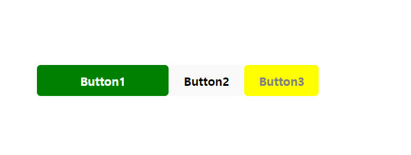

# 프로젝트 캠프 6일차

금요일이당~

집에 가기 전에 블로그 올리는게 매일 목표였는데 6일차에는 실패 (ㅠ 앞으로 쉽지 않을듯..?) 프로젝트 캠프 시작하고 맞이하는 첫 주말이요 주말에 복습하고 정리하고 할 게 많지만 그래도 아자아자~ 오늘의 이모지는 불꽃놀이~ friday night~

[🔊 너에게 닿기를](https://www.youtube.com/watch?v=86Hucafv918)

# 리액트

## 복습

복습 겸 처음 vite를 통해 리액트 프로젝트를 구성하면

```jsx
├── node_modules/
├── public/
├── src/
│ ├── assets/
│ ├── App.css
│ ├── App.tsx
│ ├── index.css
│ ├── main.tsx
│ ├── vite-env.d.ts
├── .eslintrc.cjs
├── .gitignore
├── index.html
├── package-lock.json
├── package.json
├── README.md
├── tsconfig.json
├── tsconfig.node.json
├── vite.config.ts
```

요렇게 되어 있는데 기본적으로 `main.tsx` 를 통해 진입하고 `App` 컴포넌트를 DOM에 렌더링==웹페이지에 표시한다. `App.tsx` 를 **루트 컴포넌트**로 다른 컴포넌트들은 여길 통해 DOM에 올라간다.

> re) "DOM에 렌더링한다"는 것은 리액트 컴포넌트가 가상 DOM을 통해 실제 DOM으로 변환되어 브라우저 화면에 표시되는 과정을 의미

앞으로 공부를 진행하면 대부분 `App` 컴포넌트를 사용하므로 간단히 `main.tsx` 를 짚고 가면

```jsx
// main.tsx
import React from 'react'
import ReactDOM from 'react-dom/client'
import App from './App.tsx'
import './index.css'

ReactDOM.createRoot(document.getElementById('root')!).render(
  <React.StrictMode>
    <App />
  </React.StrictMode>,
)
```

- **`ReactDOM.createRoot`**는 **`root`**라는 루트 DOM 컨테이너를 생성합니다. 이 루트 컨테이너는 **`public/index.html`** 파일 내의 **`<div id="root"></div>`** 요소를 참조합니다.
- **`root.render`** 메서드는 리액트 컴포넌트를 해당 루트 DOM 요소에 렌더링합니다. 여기서는 **`<App />`** 컴포넌트를 렌더링하고 있습니다.

---

## 컴포넌트 🎆

> 1. rafc 단축키를 이용해 컴포넌트를 작성하자
> 2. 자동 import 경로설정 추가는 컴포넌트 이름의 끝에서 ctrl+space

**`.button`** 클래스가 아닌 **`button`** 태그에 직접 스타일을 적용하고 있기 때문에 선택자 앞의 점(**`.`**)을 지워야 합니다. 이렇게 하면 **`button`** 태그를 가진 모든 요소에 스타일이 적용됩니다.

## 리액트 컴포넌트 CSS 스타일링 🎆

참고 https://www.youtube.com/watch?v=j5P9FHiBVNo

리액트 컴포넌트를 스타일링하는 방법에는 4가지가 있다.

1. CSS stylesheets
2. Inline styling
3. CSS Modules
4. CSS in JS Libaries

### ❇️ 인라인 스타일

HTML 태그의 `style` 속성을 사용해서 CSS 스타일을 지정한다. CSS 속성의 이름은 카멜 케이스로 작성해야 한다. (EX) fontSize, backgroundColor)

App.tsx

```jsx
import "./App.css";
import Inline from "./components/Inline";

function App() {
  return (
    <>
      <div className="App">
        <Inline></Inline>
      </div>
    </>
  );
}

export default App;
```

1. 컴포넌트의 첫 글자는 대문자로 시작한다.
2. 리턴문이 길어지면 () 괄호로 묶는다.
3. React Fragment는 여러 요소를 그룹화하여 묶을 때 사용한다. (<></>)
4. **셀프 클로징 태그** `<Inline />` 로 컴포넌트를 사용하면 더 코드를 간결하게 사용할 수 있다.

Inline.tsx

```jsx
const heading = {
  fontSize: "72px",
  color: "blue",
};
function Inline() {
  return (
    <div>
      <h1 style={heading}> Inline </h1>
    </div>
  );
}
```

객체를 선언해 CSS 속성을 정의하고 해당 객체를 JSX 엘리먼트(<abc>)의 `style` 속성에 전달한다.

---

**re) 타입스크립트 화살표 함수**

```jsx
const add = (a: number, b: number): number => a + b;
```

화살표 함수는 기본적으로 `()` 괄호 안에 인자를 받고 `:` 콜론의 우측에 리턴 값을 받는다. 타입스크립트이므로 변수마다 콜론과 함께 타입을 기입해야 한다. 리턴 값에는 타입만 적고 변수 이름은 적지 않는다.

```jsx
// 두 숫자의 합과 곱을 계산하여 반환하는 화살표 함수 정의
const calculate = (num1: number, num2: number): [number, number] => {
  const sum = num1 + num2;
  const product = num1 * num2;
  return [sum, product];
};
```

---

ButtonIn.tsx

```tsx
const ButtonIn = () => {
  return (
    <button
      style={{
        backgroundColor: "#d3d3d3",
        border: "none",
        color: "black",
        padding: "15px 32px",
        textAlign: "center",
        textDecoration: "none",
        display: "inline-block",
        fontSize: "20px",
        margin: "4px 2px",
        cursor: "pointer",
      }}
    >
      click
    </button>
  );
};

export default ButtonIn;
```

### ❇️ 외부 스타일 External Stylesheet

별도의 CSS 파일을 작성하고 컴포넌트에 연결해서 사용한다. 이 방식은 각 컴포넌트에서 동일한 스타일을 공유하거나 전역적인 스타일 적용에 편리하다. 즉 전역적으로 적용되므로 컴포넌트 사이에 스타일 충돌이 발생할 수 있다.

### ❇️ **CSS Modules**

외부 스타일에서 한 단계 발전한 방법이다. 특정 컴포넌트에만 종속되는 CSS 코드를 작성할 수 있다.

파일명이 `*.module.css`이다.

```jsx
/* Button.module.css */

.button {
  background-color: #007bff;
  color: #fff;
  padding: 10px 20px;
  border: none;
  border-radius: 5px;
}

.button:hover {
  background-color: #0056b3;
}
```

```jsx
// Button.tsx
import styles from "./Button.module.css"; // CSS 모듈 import

const Button = () => {
  return (
    <button className={styles.button}>
      Click me
    </button> /* CSS 모듈 클래스 적용 */
  );
};

export default Button;
```

### ❇️ **Tailwind CSS** 🎆

```tsx
# 설치
npm install -D tailwindcss # D는 save-dev 줄임말
npx tailwindcss init # tailwind.config.js 생성
```

tailwind.config.js

```jsx
export default {
  content: ["./src/**/*.{js,jsx,ts,tsx}"],
  theme: {
    extend: {},
  },
  plugins: [],
};
```

src/index.css

```jsx
// 상단에 추
@tailwind base;
@tailwind components;
@tailwind utilities;
```

vite.config.js

```jsx
import { defineConfig } from "vite";
import react from "@vitejs/plugin-react";
import tailwindcss from "tailwindcss";

// https://vitejs.dev/config/
export default defineConfig({
  plugins: [react(), vanillaExtractPlugin(), wyw()],
  css: {
    postcss: {
      plugins: [tailwindcss()],
    },
  },
});
```

tailwind에서 자주 사용되는 속성

```jsx
1. 색상 : 색은 숫자가 작을수록 밝고 명도 높은 흰색에 가까운 색이다.
bg-blue-500
text-red-600

2. 패딩과 마진 (x 좌우, y 위아래) : 패딩은 내부 여백, 마진은 외부 여백
p-4 : 모든 방향의 패딩을 1로
m-2 : 모든 방향의 마진은 0.5로
py-2 : 위아래 패딩 설정
mx-4 : 좌우 마진 설정

3. 폰트와 텍스트
font-bold
text-lg : 텍스트 크기 크게

4. 그리드
grid-cols-2 : 그리드 열의 개수 2개

5. 호버
hover:bg-gray-200

6. 포지션, 위치
absolute top-0 left-0 : 절대 위치
fixed top-0 left-0: 고정 위치

7. 모서리 둥글게, 라운드
rounded : 모든 모서리 둥글게

8. 크기
w-32
h-12
```

tailwind 적용 연습해보기 next에서 이거 씀


## props 🎆

리액트 `props`는 **부모 컴포넌트로부터 자식 컴포넌트로 데이터를 전달**하는 데 사용됩니다. "props"는 "properties"의 줄임말로, 컴포넌트에 전달되는 데이터를 의미합니다. 이를 통해 다양한 컴포넌트 간에 데이터를 전달하고 재사용할 수 있습니다.

- props는 단방향으로 항상 위에서 아래로, 부모에서 자식으로만 흐른다.

### ❇️ 기본지식

1. **Props의 전달**
   1. **`<ChildComponent propName={propValue} />`** 와 같은 형태로 전달
2. **Props의 사용**
   1. **`const ChildComponent = (props) => { ... }`** 와 같이 함수 내에서 props 사용 가능
3. props는 읽기 전용 데이터로 자식 컴포넌트에서 직접 수정이 불가능
4. 디폴트값 설정해서 전달 가능하다.
5. 타입스크립트에서는 props의 타입을 검사할 수 있다.

```jsx
<Component 속성={값} />
```

예제

```jsx
const PropsEx = (props: { name: string }) => {
  return (
    <>
      <h1>This is Props {props.name}</h1>
    </>
  );
};
export default PropsEx;

// App.tsx
...
<PropsEx name={"propsName"} /> // {}로도 전달 가능. 생략해도 됨
```

인자를 동적으로 컴포넌트에 전달해서 사용할 수 있다는 것이 props이다. children은 props에 내장된 속성으로 `props.children` 을 사용하면 부모 컴포넌트로부터 넘겨받은 내용에 접근할 수 있다.

### ❇️ props.children

```jsx
// 부모인 App.tsx 일부
<div>
  <ChildProps style={childStyle} fromParent={1}>
    <p>This is ParentComp</p>
    <button>Parent BTN</button>
  </ChildProps>
</div>
```

위의 코드에서 `ChildProps` 태그 사이의 **p태그와 button 태그, style은** `props.children` 으로 전달된다.

```jsx
interface IChildProps {
  children: React.ReactNode; // 리액트 노드 타입의 자식 요소를 받음
  className?: string;
  style?: CSSProperties;
  fromParent?: number;
}

const ChildProps = (props: IChildProps) => {
  const { children, className = "", style = { style }, fromParent } = props; // props를 구조 분해 할당으로 받음
  return (
    <>
      <div className={`$className`}>
        {children}
        {fromParent === 1 && (
          <>
            <p>10</p>
            <p>Received from parent</p>
          </>
...
```

자식 컴포넌트인 `ChildProps` 에서는 부모 컴포넌트에게서 `props` 를 받아오는데 미리 설정한 인터페이스를 타입으로 가진다. 구조 분해 할당으로 props의 속성을 변수로 할당받고 할당받은 내용들을 해당 컴포넌트에서 사용한다.

---

**rpe) 구조분해할당**

배열이나 객체를 **해체하여 그 값을 개별 변수에 할당**하는 JavaScript의 문법

```jsx
const data = {
  user: {
    name: "Alice",
    age: 25,
  },
  scores: [10, 20, 30, 40, 50],
};
const {
  user: { name, age },
  scores: [firstScore, ...restScores],
} = data;

console.log(name); // 'Alice'
console.log(age); // 25
console.log(firstScore); // 10
console.log(restScores); // [20, 30, 40, 50]

console.log(data.user.name); // 'Alice' 코드가 더 간결해짐
```

---

### ❇️ Children Props

React에서 `children prop`는 컴포넌트의 속성 중 하나로, 컴포넌트의 자식 요소들을 포함합니다. 이를 통해 부모 컴포넌트는 자식 컴포넌트를 동적으로 렌더링할 수 있습니다. `children prop`은 모든 React 컴포넌트에 기본적으로 존재하며, 주로 컴포넌트 간의 구성 요소를 더 쉽게 재사용하고, 동적으로 컨텐츠를 전달할 때 유용합니다.

- 비구조화 할당

```tsx
// props로부터 children을 분리하고 나머지 속성들을 restButtonProps에 할당
const { children, ...restButtonProps } = props;
```

## 리액트 훅 🎆

### ❇️ useState

```tsx
import { useState } from "react";
const App = () => {
  const [count, setCount] = useState(0); // count가 0으로
  const clickHandler = () => {
    console.log(count);
    // count++; 직접 접근 불가능!!
    setCount(count + 1);
  };
  return (
    <>
      <h1>Count : {count}</h1>
      <button onClick={clickHandler}>증가</button>
    </>
  );
};

export default App;
```

`useState` 는 내부적으로 제네릭을 사용한다. 제네릭 타입 `<S>`를 사용하는데 이는 상태의 타입을 지정하는데 사용된다. 즉 처음 useState를 호출할 때 상태의 초기값으로 사용해 타입을 지정한다. 이 때 타입추론이 일어난다.

```tsx
const [count, setCount] = useState<number>(0);
// 원래는 이게 맞다
// 타입스크립트의 타입추론 덕분에 이렇게 안 써도 됨, 0이므로 알아서 number로 추정
```

```tsx
import { useState } from "react";
import DisplayNumber from "./components/DisplayNumber";
const App = () => {
  const [count, setCount] = useState(0); // count가 0으로
  const clickHandler = () => {
    console.log(count);
    // count++; 직접 접근 불가능!!
    setCount(count + 1);
  };
  return (
    <>
      <DisplayNumber count={count} />
      {/* <h1>Count : {count}</h1> */}
      <button onClick={clickHandler}>증가</button>
      <Button
        style={{
          width: "177px",
          color: "white",
          backgroundColor: "blue",
        }}
        onClick={clickHandler}
      >
        Add
      </Button>
    </>
  );
};
```

**-. classNames.bind(styles)**

CSS 클래스를 동적으로 조작하는 데 사용되는 classNames 라이브러리의 기능을 활용하는 코드.

CSS 모듈 방식에서 `className={styles.button}` 이런 식으로 컴포넌트 태그 안에서 추가적으로 작성해야 했는데 따로 `bind` 해서 코드의 가독성을 높이기 위함이다.

```tsx
import styles from "./Button.module.css";
import classNames from "classnames/bind";

type ButtonProps = React.ComponentProps<"button"> & {
  children: React.ReactNode;
  onClick?: () => void; // 클릭 이벤트 핸들러
};

const Button = (props: ButtonProps) => {
  const { children, style, ...restButtonProps } = props;
  const bindStyles = classNames.bind(styles);
  return (
    <button className={bindStyles("button")} style={style} {...restButtonProps}>
      {children}
    </button>
  );
};

export default Button;
```

## **실습 버튼 컴포넌트 만들기**🎆

App.tsx

```jsx
import "./App.css";
import Button from "./components/Button";

const btnStyle1 = {
  width: "177px",
  color: "white",
  backgroundColor: "green",
};
const btnStyle2 = {
  width: "100px",
  color: "gray",
  backgroundColor: "yellow",
};
function App() {
  return (
    <>
      <Button style={btnStyle1}>Button1</Button>
      <Button>Button2</Button>
      <Button style={btnStyle2}>Button3</Button>
    </>
  );
}

export default App;
```

Button.tsx

```jsx
// 버튼의 가로, 배경색, 글자색 변경 가능
interface IButtonProps {
  children: React.ReactNode;
  style?: React.CSSProperties; // 부모 컴포넌트에서 전달된 스타일 속성
}
// 공통으로 사용될 스타일 객체 정의
const defaultBtnStyle: React.CSSProperties = {
  padding: "10px 20px",
  border: "none",
  borderRadius: "5px",
  cursor: "pointer",
  fontWeight: "bold",
};

const Button = (props: IButtonProps) => {
  const { children, style, ...restIButtonProps } = props; // 구조분해할당
  const buttonStyle: React.CSSProperties = {
    // 전달된 스타일과 기본 스타일 병합
    ...defaultBtnStyle,
    ...style,
  };
  return (
    <>
      <button {...restIButtonProps} style={buttonStyle}>
        {children} {/* 버튼 내용을 children으로 전달 */}
      </button>
    </>
  );
};
export default Button;
```



---

## 입력받기 🎆

```tsx
import { useState } from "react";

const App = () => {
  const [inputStr, setInput] = useState("");
  const onChangeHandler = (value: string) => {
    setInput(value);
  };
  return (
    <>
      <h1>{inputStr}</h1>
      <input
        type="text"
        value={inputStr}
        onChange={(e) => setInput(e.target.value)}
      ></input>
    </>
  );
};

export default App;
```

select

```tsx
import { useState, ChangeEvent } from "react";

const App = () => {
  const [selectedOption, setSelectedOption] = useState("");

  const handleChange = (event: ChangeEvent<HTMLSelectElement>) => {
    setSelectedOption(event.target.value);
  };

  return (
    <div>
      <h1>Selected Option: {selectedOption}</h1>
      <select value={selectedOption} onChange={handleChange}>
        <option value="">Select an option</option>
        <option value="option1">Option 1</option>
        <option value="option2">Option 2</option>
        <option value="option3">Option 3</option>
      </select>
    </div>
  );
};

export default App;
```

checkbox

```tsx
import { useState, useEffect, ChangeEvent } from "react";
import { v4 as uuidv4 } from "uuid";

const App = () => {
  const [isChecked, setIsChecked] = useState(false);
  const [checkboxId, setCheckboxId] = useState<string>("");

  useEffect(() => {
    setCheckboxId(uuidv4());
  }, []);

  const handleChange = (event: ChangeEvent<HTMLInputElement>) => {
    setIsChecked(event.target.checked);
  };

  return (
    <div>
      <h1>Checkbox State: {isChecked ? "Checked" : "Unchecked"}</h1>
      <label htmlFor={checkboxId}>
        <input
          type="checkbox"
          id={checkboxId}
          checked={isChecked}
          onChange={handleChange}
        />
        Check me
      </label>
    </div>
  );
};

export default App;
```

**`uuidv4()`** 함수를 사용하여 랜덤 아이디를 생성하고, **`useEffect`** 훅을 사용하여 컴포넌트가 처음 렌더링될 때 한 번만 이 아이디를 설정합니다. 이렇게 하면 체크박스가 렌더링될 때마다 새로운 아이디가 생성되어 체크박스들 간의 고유성이 보장됩니다.

**`htmlFor`** 속성을 사용하여 레이블과 체크박스를 연결하고, 체크박스의 **`id`** 속성에 아이디를 할당하여 레이블과 체크박스가 연결되도록 합니다. 이렇게 함으로써 체크박스를 누를 때마다 해당 레이블을 클릭한 것으로 처리되어 사용자 편의성을 높일 수 있습니다.

### useRef🎆

```tsx
const inputEl = useRef<HTMLInputElement>(null);
```

1. **`useRef`**: useRef 훅은 React 컴포넌트 내에서 DOM 요소에 접근할 때 사용됩니다. 이 훅을 사용하면 함수 컴포넌트 내에서 DOM 요소를 선택하고 조작할 수 있습니다.
2. **`useRef<HTMLInputElement>(null)`**: 이 코드는 useRef 훅을 사용하여 DOM 요소에 대한 참조를 생성합니다. **`<HTMLInputElement>`**은 참조하려는 DOM 요소의 타입을 나타냅니다. **`null`**은 초기값으로 설정되며, useRef를 호출할 때 DOM 요소에 대한 초기 참조가 없음을 나타냅니다.
3. **`const inputEl`**: 이 코드는 useRef를 통해 생성된 참조를 저장할 변수를 선언합니다. 이 변수를 통해 후속 코드에서 DOM 요소에 액세스할 수 있습니다.

inputEl을 통해 input 요소에 직접 액세스할 수 있게 됩니다.

---

본 후기는 본 후기는 [유데미x스나이퍼팩토리] 프로젝트 캠프 : Next.js 1기 과정(B-log) 리뷰로 작성 되었습니다.
