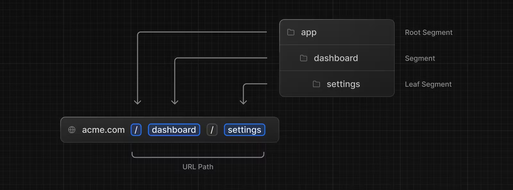
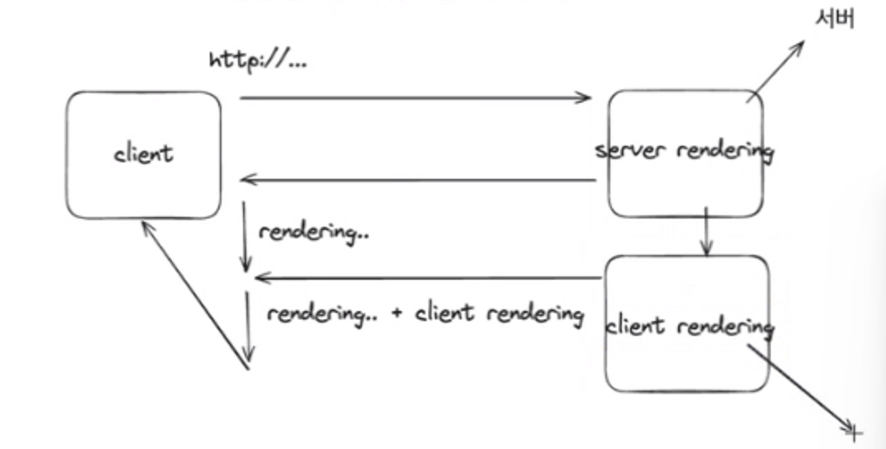
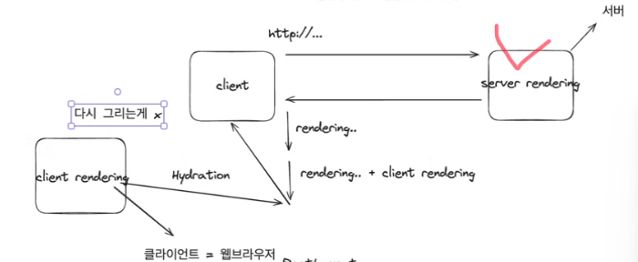
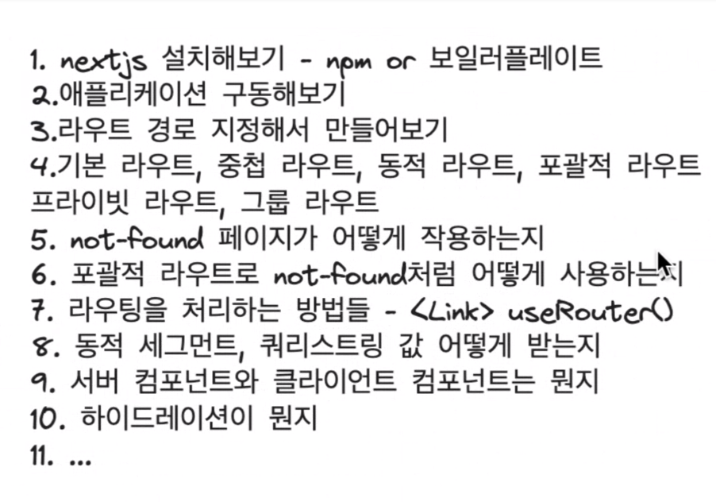

# 프로젝트 캠프 10일차

[🔊누군가의 하루 끝에 녹아서](https://www.youtube.com/watch?v=H0hZCJVEFsY)

## todo를 zustand로 전역상태 관리하기 🍮

데이터 패치 부분도 store로 옮기기 가능

### ❇️ axios instance

axios 인스턴스 사용하는 걸로 업데이트하기

libs/http.ts 생성

axios 불러오기, 인스턴스 생성, baseURL 설정

```tsx
import axios from "axios";
// export하기
export const axiosInstance = axios.create({
  baseURL: "http://localhost:4000",
  timeout: 1000,
  headers: { "Content-Type": "application/json" },
});
```

zustand에서 해당 인스턴스 사용하기

axios 대신에 axiosInstance 사용

```tsx
export const useTodoStore = create<TodoStoreType>((set) => ({
  todos: [],
  fetchTodos: async () => {
    // api call
    const response = await axiosInstance.get("/todos");
    // get의 인자로 주소 전달 생략 가능, baseURL 이용
    if (response.status === 200) {
      set({ todos: response.data });
    }
  },
  ...
```

+. ❇️

`zustand`의 `useStore` 훅을 사용할 때 메모이제이션을 통해 성능을 최적화하기 위해서는 비구조화 할당을 지양하고 **필요한 상태나 액션만 선택하여 사용**해야 한다.

```tsx
import { create } from "zustand";

const useStore = create((set) => ({
  count: 1,
  inc: () => set((state) => ({ count: state.count + 1 })),
}));

function Counter() {
  const { count, inc } = useStore(); // counst와 inc를 비구조화할당
  // 메모이제이션 안됨
  return (
    <div>
      <span>{count}</span>
      <button onClick={inc}>one up</button>
    </div>
  );
}
```

비구조화 할당을 피하고 필요한 상태나 액션만 선택하도록 `useStore` 훅을 사용해야 한다.

```tsx
function Counter() {
  // count 상태만 선택
  const count = useStore((state) => state.count);
  // inc 액션만 선택
  const inc = useStore((state) => state.inc);
```

이러한 방식으로 사용하면 count나 inc 중 하나만 변경될 때 해당 변경 사항이 관련된 부분만 재렌더링된다.

이전의 방식은 count나 inc 중 하나만 변경되어도 컴포넌트 전체가 재렌더링된다. 그러므로 필요한 상태나 함수를 useStore로 하나씩 가져오는 것이 좋다.

---

# NEXT.JS

next.js는 리액트에서 확장된 프레임워크이다.

### 라이브러리와 프레임워크

라이브러리는 개발자의 자율성이 더 크고 개발자가 주체적으로 라이브러리를 필요한 곳에 사용한다. 개발자가 라우터 설정, 상태 관리 라이브러리 선택, 빌드 설정 등을 직접 관리해야 한다.

프레임워크는 정해진 절차와 방법을 개발자가 쫓아가며 개발한다. 프레임워크가 주체인 느낌이다. 정해진 방법을 통해 빠르고 일관성 있는 개발이 가능하다.

```tsx
// package.json
"scripts": {
    "dev": "next dev", // dev 명령어로 구동 가능
```

### ❇️ Next.js 프로젝트 구조

1. `pages/app` 폴더

   페이지 컴포넌트를 정의한다. pages 폴더 안에는 `index.tsx` 파일이 반드시 필요하다. 이 파일은 루트 경로로 매핑되어 초기 화면을 렌더링한다.

2. 라우팅 방식

   next.js는 `앱 라우팅 방식` 과 `페이지 라우팅 방식` 의 2가지 라우티 방식을 지원한다. 페이지 라우팅 방식은 pages 폴더를 이용해 url 경로에 매핑하고 앱 라우팅 방식은 app 폴더를 이용해 경로를 매핑한다. 앱 라우팅은 레이아웃을 보다 쉽게 관리할 수 있도록 설계되었다.

   ```tsx
   my-next-app/
   ├── pages/
   │   ├── index.tsx
   │   ├── about.tsx
   │   └── contact.tsx
   ---------------------
   my-next-app/
   ├── app/
   │   ├── layout.tsx
   │   ├── page.tsx
   │   ├── about/
   │   │   └── page.tsx
   │   └── contact/
   │       └── page.tsx
   ```

   마이그레이션할 때는 이 라우팅 방식을 바꾸는 것이 주된 목표이다. next.js 14부터 앱 라우팅 방식을 도입하기 시작했다.

## 보일러 플레이트 **(Boilerplate)**

보일러 플레이트란 개발에서 반복적으로 사용되는 코드나 파일 구조를 미리 작성해놓은 템플릿이다. 새로운 프로젝트를 시작할 때 기본적인 설정과 구조를 반복해서 작성할 필요없이 빠르게 시작할 수 있도록 한다.

```tsx
npx create-next-app@latest . // 현재 경로에 설치
```

### 메타데이터

next.js는 기본적으로 메타데이터를 자동으로 export 해주기 때문에 따로 설정할 필요 없다. 페이지나 레이아웃 수준에서 추가적인 설정이 가능하다.

```tsx
// page.tsx
export const metadata: Metadata = {
  title: "Hello Create Next App",
  description: "Generated by create next app",
};
```

### 라우팅, 라우터, 라우트



라우팅은 웹에서 사용자가 URL을 통해 다른 페이지로 이동하는 것이다. 사용자가 다른 경로를 입력하면 해당 경로의 새로운 컨텐츠가 표시된다.

라우터는 위의 라우팅을 관리하고 처리하는 기능이다. NEXT.js에서는 내장된 라우팅 시스템을 사용해 페이지 간의 이동을 처리한다. 일반적으로 라우터는 사용자의 URL을 해석하고 해당 URL에 맞는 컴포넌트를 렌더링한다.

라우트는 URL과 특정 컴포넌트 간의 매핑을 나타낸다. 페이지의 경로와 해당 경로에 표시할 컴포넌트 사이의 매핑이다.

## Next.js 라우팅

기본적으로 폴더 기반으로 이루어진다. 폴더 구조에서 각 경로의 컴포넌트는 page.tsx 파일로 정의한다. 각 폴더마다 page.tsx 파일을 가지고 있어도 충돌하지 않는다. 하나의 page.tsx에서 export할 때 앨리어스를 사용해 컴포넌트를 내보낼 수 있다.

> 파일이름과 폴더 이름은 케밥케이스(kebab-case)를 사용한다. (”-”로 여러 단어 구분)

### 중첩경로 + 동적 경로

```tsx
app/
└── blog/
    └── [id]/
        └── comment/
            └── [commentid]/
                └── page.tsx  -> /blog/[id]/comment/[commentid]
```

대괄호([])를 사용하면 동적 세그먼트를 나타내며 실제 URL에서 변수로 대체된다. 중첩된 동적 세그먼트는 고유한 이름을 가져야 한다.

### Catch-All 세그먼트

동적 라우팅에서 사용되면 대괄호([])를 사용해 표시한다. 이를 통해 **하위 경로의 모든 조합**을 캡처할 수 있다.

```tsx
pages/
└── docs/
    └── [...slug].tsx
```

### Private 폴더 + 그룹 경로

private 폴더는 특정 세그먼트의 이름을 차지하지 않는다. ‘\_’로 시작한다. 경로 입력으로 접근할 수 없다.

그룹경로는 ‘()’괄호를 이용하며 세그먼트의 한 자리를 차지하지 않는다. 여러 경로를 그룹으로 묶을 때 이용한다.

```tsx
pages/
│   └── _auth/
│       └── login.tsx       // 로그인 페이지: /_auth/login
└── (public)
    ├── index.tsx           // 공개 페이지: /public/index
    ├── about.tsx           // 공개 페이지: /public/about
    └── contact.tsx         // 공개 페이지: /public/contact
```

### not-found 페이지 설정하기

루트 경로에 not-found.tsx파일은 경로를 찾지 못했을 때 보여줄 페이지이다. next.js에서는 not-found 파일을 특정 그룹에 커스텀해서 작성할 수 없다. (중첩을 허용하지 않는다.)전체 파일 중 not-found 파일은 루트에만 존재한다. 그러나 커스텀할 수 있는 방법이 있는데 catch-all 세그먼트를 활용하는 것이다.

```tsx
pages/
├── category/
│   ├── [...slug]/
│   │   └── page.tsx       // category 동적 경로 페이지
│   └── not-found.tsx      // not-found 페이지
└── not-found.tsx           // 루트 not-found 페이지
```

cath all 세그먼트를 이용해 동적 경로 페이지를 만드는 것이다.

### layout

루트 레이아웃은 모든 페이지에 공통적으로 사용되는 헤더와 푸터가 포함된다.

```tsx
// layout.tsx
export const metadata = {
  title: {
    template: "%s | Sucoding",
    default: "Next.JS | Sucoding",
  },
  description: "Generated by Next.js",
};

export default function RootLayout({
  children,
}: {
  children: React.ReactNode;
}) {
  return (
    <html lang="en">
      <body>Root childeren : {children}</body>
    </html>
  );
}
```

$ category/layout.tsx

```tsx
// category/layout.tsx
export default function layout({ children }: { children: React.ReactNode }) {
  return (
    <>
      <div>
        <h2>Cateogry Header</h2>
        {children}
        <h2>Cateogry Footer</h2>
      </div>
    </>
  );
}
```

layout은 자식으로 children : Reatc.ReactNode 타입을 받는다.

next.js의 레이아웃은 가장 가까운 레이아웃을 따른다. 페이지 컴포넌트가 렌더링될 때 따라가는 경로에 루트 레이아웃이 아닌 다른 레이아웃이 존재한다면 해당 레이아웃을 사용한다.

## 메타데이터

메타데이터는 웹 페이지의 정보를 설명하는 데이터로 보통 html의 <meta>태그를 통해 제공된다. 여기에는 페이지의 제목, 설명, 키워드 등이 포함될 수 있다. next.js에서는 레이아웃 파일에서 메타데이터를 정의할 수 있다. 가장 인접한 레이아웃의 메타데이터가 해당 페이지에 적용된다. 이 때 커스텀해서 메타데이터를 설정할 수 있다.

루트 레이아웃의 타이틀을 {} 객체로 받아서 “%s | Sucoding”하면 하위 레이아웃의 메타데이터의 타이틀이 %s로 치환된다

루트 경로는 template 객체를 적용했기 때문에 타이틀이 보이지 않는데 해결하려면 default값을 주면 된다.

```tsx
export const metadata = {
  title: {
    template: "%s | Sucoding", // 타이틀의 템플릿
    default: "Next.js | Sucoding", // 기본 타이틀
  },
  description: "Generated by Next.js",
};
```

## 쿼리스트링

쿼리스트링은 [localhost:3000/blog?lang=ko](http://localhost:3000/blog?lang=ko) 물음표 뒤가 쿼리스트링이다.

1. useSearchParams 훅 사용

`useSearchParams` 훅은 현재 URL의 쿼리 스트링을 파싱해 객체 형태로 반환해준다. 이를 이용해 쿼리스트링을 처리할 수 있다.

> [localhost:3000/](http://localhost:3000/blog?lang=ko)blog?lang=ko&page=2

```tsx
"use client"; // 아래에서 설명
...
const searchParams = useSearchParams();
console.log(searchParams.get("lang")); // ko
console.log(searchParams.get("page")); // 2
```

쿼리스트링은 객체처럼 키와 값으로 이뤄져있다. ‘=’을 기준으로 키와 값이다. 여러 개 사용시 &로 연결한다. .

1. params 이용

훅 대신 URL 매개변수를 사용해 동적 라우팅 값에 액세스하는 방법도 있다. 컴포넌트의 인자로 들어오는 params에서 받아올 수 있다. 타입을 정의해 params와 searchParams를 전달받고 이를 통해 각 매개변수에 접근한다. 해당 코드는 리액트 라우터 v6를 사용한 것이므로 버전에 주의해야 한다.

```tsx
type TPageProps = {
	params : {};
	searchParams : {
		lang: string;
		page: string;
	};
};

export default function BlogPage(params : TPageProps){
	const {searchParams} = params;
	console.log(searchParams.lang); // vs 터미널에서 출력
	console.log(searchParams.page); // vs 터미널에서 출력
	return (
	...
```

### usePathname

현재 페이지의 경로를 가져오는 리액트 라우터의 훅이다. 이를 사용해 현재 페이지의 경로에 따라 서로 다른 스타일을 적용할 수 있다.

```tsx
import { usePathname } from "react-router-dom";

function MyComponent() {
  const pathname = usePathname();
  // 현재 경로에 따라 스타일 클래스 결정
  const className = getPathnameStyle(pathname);
  return (
    <div className={className}>
      <h1>Welcome to my website!</h1>
      <p>This is the home page.</p>
    </div>
  );
}
// 경로에 따라 다른 스타일 클래스를 반환하는 함수
function getPathnameStyle(pathname) {
  switch (pathname) {
    case "/about":
      return "about-page";
    case "/contact":
      return "contact-page";
    default:
      return "default-page";
  }
}
```

## Next.js 컴포넌트

nextjs에는 두 가지 컴포넌트가 존재한다. 서버 컴포넌트는 서버 측에서 실행되는 리액트 컴포넌트로 서버 측 렌더링 SSR(Server Side Rendering)을 지원하여 서버에서 컴포넌트를 렌더링하고 초기 HTML을 생성한다. 생성된 HTML을 클라이언트로 전달해 웹페이지의 초기 로딩 시간을 줄이고 SEO(검색 엔진 최적화)를 향상시킨다.

클라이언트 컴포넌트는 브라우저에서 실행되는 리액트 컴포넌트이다. 클라이언트 측 렌더링(CSR, Client Side Rendering)을 지워해 서버에서 초기 html을 전달받고 이후에 클라이언트에서 자바스크립트를 사용해 컴포넌트를 렌더링하고 상호작용한다. 클라이언트 컴포넌트는 주로 `useEffect` 훅을 사용해 컴포넌트가 마운트된 후에 실행되는 로직이나 API 호출 등을 수행한다.

NEXT.js는 서버 컴포넌트와 클라이언트 컴포넌트를 함께 사용한다.

### 하이드레이션 hydration



두 번의 렌더링 후 합쳐지는 과정을 의미한다. 하이드레이션은 서버에서 렌더링된 초기 html에 클라이언트에서 실행되는 자바스크립트를 적용해 초기 html을 보강하고 클라이언트에서의 상호작용을 활성화하는 것이다. 즉 클라이언트 렌더링 때 다시 그리는 것이 아니라 기존의 뼈대에 수분을 공급하는 것처럼 추가적인 기능을 덧입히는 것이다.

```tsx

  return (
    <div>
      {/* count 변수의 값을 화면에 출력 */}
      <p>Count: {count}</p>
      {/* 버튼을 클릭하면 handleClick 함수를 실행 */}
      <button onClick={handleClick}>Increase Count</button>
    </div>
  );
}
```



“use client”를 쓰면 해당 컴포넌트는 클라이언트 컴포넌트이다. console.log하면 웹에서 출력되고 터미널에서도 출력된다. 그 이유는 기본적으로 모든 컴포넌트는 서버 컴포넌트이다. 그러므로 일단 렌더링된다. 그 중 클라이언트 컴포넌트들은 하이드레이션되며 한 번 더 렌더링된다.

> 클라이언트 컴포넌트도 서버에서 렌더링이 된다.

면접질문…next.js 14…

### SSG(Static Site Generator) 정적 사이트 생성기 🍮

npm run build 명령을 실행하면 next.js 앱이 빌드되어 정적 파일들로 생성된다. 이 때 생성된 정적 파일들은 정적과 동적인 2가지 유형으로 나뉜다.

`static` 유형의 파일들은 사전 렌더링(pre-rendering)되어 정적 컨텐츠로 생성된다. 즉 모든 페이지가 사전에 렌더링되어 html 파일로 생성된다. 이 파일들은 서버에 요청이 발생할 때마다 그대로 리턴된다. 따라서 서버 측에서 추가적인 처리 없이 파일을 제공할 수 있다. 주로 컨텐츠가 변하지 않는 페이지나 많은 사용자들이 접속하는 페이지 등에 사용된다.

`dynamic` 유형의 파일들은 요청이 있을 때에만 서버에서 렌더링되어 생성된다. 즉 서버 측에서 요청이 들어올 때마다 해당 페이지를 동적으로 렌더링하고 html 파일을 리턴한다. 주로 로그인 상태나 사용자가 요청하는 동적인 컨텐츠가 포함된 페이지에 사용된다. 최신 정보 필요로 하는 페이지.

```tsx
○  (Static)   prerendered as static content
ƒ  (Dynamic)  server-rendered on demand
```

`SSG` 는 웹사이트의 모든 페이지를 빌드 시점에 미리 생성해 정적 파일로 저장하는 방식이다. 사전에 페이지를 렌더링하고 html 파일로 저장해두어 응답 속도가 빠르고 서버 부하가 감소한다. 또 SEO 최적화, 캐싱 및 CDN 적요 등에서 장점이 있다.

## 네비게이션 구현 🍮

a태그는 html에서 하이퍼링크를 생성하는데 사용된다. 그러나 next에서는 a태그를 쓰면 페이지 전체가 통째로 리로드되므로 비효율적이다. 링크로 이동할 때 해당 페이지 전체를 새로 읽어온다. 대신 `Link` 컴포넌트를 이용하면 변경되는 사항만 렌더링되어 효율적이다.

### ❇️ Link 컴포넌트

링크 컴포넌트는 next.js에서 제공하는 네비게이션을 위한 컴포넌트이다. 이를 사용하면 페이지가 전체적으로 새로고침되지 않고 변경된 부분만 다시 렌더링된다.

```tsx
import Link from "next/link";

function Navigation() {
  return (
    <nav>
      {/* 클릭 시 '/about' 페이지로 이동 */}
      <Link href="/about">
        <a>About</a>
      </Link>
    </nav>
  );
}
```

### ❇️ useRouter 훅 사용

링크를 처리하는 다른 방법으로 useRouter 훅을 사용할 수 있다. 해당 훅을 사용해 현재 경로와 쿼리 파라미터 등 라우팅과 관련된 정보를 가져올 수 있다. 이 때 주의할 것이 next/router과 next/navigation 두 가지 import가 있는데 네비게이션을 import 해야 한다.

```tsx
import { useRouter } from "next/router";
function Navigation() {
  const router = useRouter();

  const handleAboutClick = () => {
    // 클릭 시 '/about' 페이지로 이동
    router.push("/about");
  };

  const handleContactClick = () => {
    // 클릭 시 '/contact' 페이지로 이동
    router.push("/contact");
  };

  return (
    <nav>
      <button onClick={handleAboutClick}>About</button>
      <button onClick={handleContactClick}>Contact</button>
    </nav>
  );
}
```

`push` 는 새로운 항목을 히스토리 스택에 추가하고 해당 url로 이동한다. 히스토리에 추가되므로 사용자가 뒤로 가기 버튼을 클릭하면 이전 url로 다시 이동할 수 있다.

`replace` 는 현재 항목을 새로운 항목으로 교체한다. 이전 항목은 히스토리 스택에서 제거되므로 사용자가 뒤로 가기 버튼을 클릭하면 이전 rul로 다시 이동할 수 없다. 주로 사용자 결제 페이지처럼 다시 접근하지 못하게 하는 페이지 이동에서 사용한다.

`redirect` 컴포넌트는 사용자를 다른 경로로 리다이렉트하는데 사용된다. 특정 조건에 따라 사용자를 다른 페이지로 자동으로 이동시킬 수 있다.

```tsx
import { Redirect } from "react-router-dom";

function ProtectedPage({ isLoggedIn }) {
  if (!isLoggedIn) {
    // 사용자가 로그인하지 않은 경우 로그인 페이지로 리다이렉트
    return <Redirect to="/login" />;
  }
  // 로그인한 경우 보호된 페이지를 표시
  return <div>Protected Page Content</div>;
}
```

## 복습



못하면 모르는 거임

## 폰트 최적화

1. 기존 폰트 적용방법

구글 폰트 웹사이트에서 사용할 폰트를 선택하고 장바구니 담고 임베디드 코드를 복사한다. 선택한 폰트를 global.css에 붙여고 링크를 import한다.

```tsx
/* global.css */
@import url('https://fonts.googleapis.com/css2?family=Roboto:wght@400;700&display=swap');

body {
  font-family: 'Roboto', sans-serif;
}
```

.

```tsx
// 예시 컴포넌트
function ExampleComponent() {
  return <div className="roboto">This text will use the Roboto font.</div>;
}
```

`className=”roboto”` 를 사용해 폰트를 적용한다.

1. Next.js 폰트 적용

```tsx
import { Inter } from "next/font/google"; // inter에 불어오고 싶은 폰트이름 ex)roboto
```

폰트를 불러오고 폰트 인스턴스 객체를 만든다.

```tsx
const roboto = Roboto
								({weight:["400","700"], subsets:["latin"]});
// 노멀이 400 굵게가 700
...
<h1 className={roboto.className}>font<h1>
```

`className={roboto.className}` 을 사용한다.

**최적화 확인**

새로고침, 네트워크에 disable cache를 적용하기.

기본방법은 폰트가 깜빡거린다 = 폰트적용 찰나 버퍼링이 걸린다.

두번째 방법은 그렇지 않다. 왜? 서버 렌더링할 때 이미 폰트가 적용되기 때문이다.

우리 눈에 보일 때는 이미 폰트가 적용된 상태로 보인다.

```tsx
// 필요한 폰트 불러오기
import { Inter } from "next/font/google";

// 폰트 인스턴스 객체 만들기
const roboto = Inter({ weight: ["400", "700"], subsets: ["latin"] });

// 폰트를 적용할 컴포넌트
function FontComponent() {
  return (
    // 폰트가 적용될 요소에 className으로 폰트의 클래스 이름을 지정
    <h1 className={roboto.className}>Font Example</h1>
  );
}
export default FontComponent;
```

---

본 후기는 본 후기는 [유데미x스나이퍼팩토리] 프로젝트 캠프 : Next.js 1기 과정(B-log) 리뷰로 작성 되었습니다.
