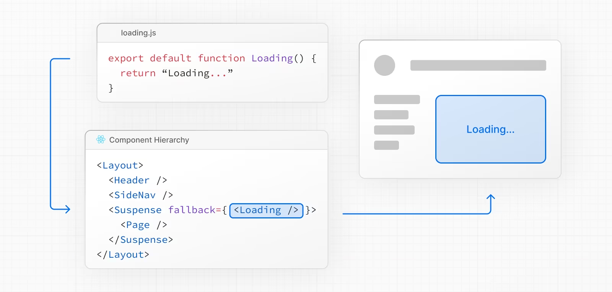
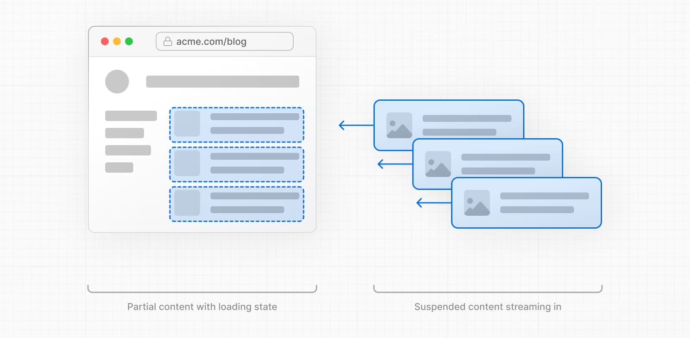

# 프로젝트 캠프 11일차

6/22

## 복습

1. 동적 세그먼트는 `users/:id` 에서 id 부분처럼 동적으로 처리되는 부분이다.
2. 쿼리스트링 처리하기
   1. `useSearchParams` 훅 사용하기
3. 메타데이터 설정하기
   1. layout의 metadata 부분을 수정해 메타데이터를 설정할 수 있다.
   2. 메타데이터는 가장 가까운 layout의 메타데이터를 페이지에 반영하므로 경로에 따라 metadata 부분 커스텀 가능
   3. `%s` 를 이용해 자식 페이지에서 동적으로 설정 가능

## not-found 페이지 커스텀

### react icons

react icons 검색해서 설치하기

```tsx
npm install react-icons --save // --save 하면 dependency에 설치함
// package.json에 추가된거 확인 가능
```

아이콘이 텍스트 기반이라 테일윈드로 글씨에 적용하듯이 적용 가능하다.

+. next.js는 Link 컴포넌트를 사용해 페이지 간의 링크를 설정한다. a태그 사용시 에러가 발생한다.

```jsx
import Link from "next/link";
```

버튼의 onClick보다 페이지 간의 네비게이션을 처리할 때는 Link 컴포넌트를 사용하자.

[참고](https://nextjs.org/docs/pages/api-reference/components/link)

## 클라이언트 컴포넌트를 최소화하기

+. app 폴더 하위에 components 폴더 만들지 않기. app 폴더는 라우팅, 경로에만 사용하기

컴포넌트 트리에서 부모 컴포넌트가 클라이언트 컴포넌트일 경우, 그 자식 컴포넌트들은 자동으로 전부 클라이언트 컴포넌트가 된다. 클라이언트 컴포넌트 아래에는 서버 컴포넌트가 올 수 없다.

컴포넌트 트리 구조 설계시 클라이언트 컴포넌트가 뿌리를 오염시키지 않게 가장 하단에, 뿌리 부분에 위치하도록 한다. 되도록 서버 컴포넌트를 활용해야 한다.

## 로딩 및 스트리밍

[참고](https://nextjs.org/docs/app/building-your-application/routing/loading-ui-and-streaming)

### loading 파일

loading은 next.js에서 예약된 파일명으로 페이지에 지연이 걸리면 loading 페이지가 보인다.

예시로 about 페이지에서 두 개의 컴포넌트를 불러오는데 각각 4초와 6초의 지연이 걸릴 경우 about 페이지는 6초의 시간 동안 loading 페이지를 보여준다.

**각 컴포넌트의 렌더링 시간이 다르다면 가장 늦게 로드되는 컴포넌트의 로딩 시간이 전체 페이지의 로딩 시간이 된다.**

loading 파일은 같은 폴더의 layout과 page 파일 및 그 하위 항목을 자동으로 `<Suspense>` 로 래핑한다.



- loading.tsx는 라우트별로 지정할 수 있다 == 중첩 가능

### 스트리밍

1. SSR 이해

   SSR을 이용하여 사용자가 페이지를 볼 때까지의 과정은 간단하게

   1. 해당 페이지의 모든 데이터 서버에서 가져옴
   2. 서버는 페이지의 HTML 렌더링
   3. 페이지의 HTML, CSS, JS가 클라이언트로 전송
   4. 클라이언트에서 HTML과 CSS가 렌더링되어 Non-Interactive한 페이지가 표시
   5. 리액트가 하이드레이션을 통해 페이지는 Interactive해진다.

   즉 모든 데이터를 가져온 후에만 서버가 페이지의 HTML을 렌더링할 수 있다. 이 때 시간이 다소 소용될 수 있다.

   **스트리밍을 사용하면 페이지의 HTML을 더 작은 청크로 나눌 수 있다** == 시간 단축

   작아진 청크 부분은 모든 데이터가 로드될 때까지 기다리지 않고 바로 렌더링 + 하이드레이션되어 더 빠르게 보여진다.

   +. streaming=사용자의 웹 화면을 끊김없이 중계=스트리밍하겠다. 빨리 렌더링되는 부분이라도 페이지에 보여주겠다.



+. 로딩바 구현

리액트 아이콘과 테일윈드의 애니메이션 animate-spin을 사용해 움직이는 로딩 애니메이션을 구현할 수 있다.

### Suspense : 병렬 렌더링

`suspense` 를 사용하면 먼저 렌더링된 부분이 페이지에 보인다.

병렬처리해서 렌더링하기 parallex rendering

suspense로 컴포넌트를 래핑하면 suspenst 영역 안의 컴포넌트들은 독자적인 렌더링 규칙이 적용된다. 먼저 로딩이 끝난 건 페이지에 보이게 된다.

이 때 페이지의 일부 컴포넌트만 suspense로 래핑하면 안되고 모든 컴포넌트를 suspense로 래핑해야 정상적으로 적용된다. fallback에 있는 내용이 우선 적용되어 사용자에게 보여진다.

멀티 로딩을 이처럼 suspense를 이용해 구현할 수 있다.

```jsx
<Suspense fallback={<MyLoading />}>
  <Server1 />
</Suspense>
```

- Server1의 작업이 진행되는 동안 fallback의 MyLoading이 보여진다.

+. 경로, 폴더, 페이지 이름 케밥케이스 / 컴포넌트는 파스칼 케이스

## Error

Next.js의 예약된 파일이름은 5가지로 `page | layout | not-found | loading | error` 이다.

에러도 중첩 가능해 라우터 경로로 커스텀이 가능하다.

기본적으로 에러페이지는 클라이언트 컴포넌트이므로 “use client”를 붙여준다.

에러 컴포넌트는 error와 reset를 props로 받아서 사용한다. error은 객체, reset는 함수이다.

reset 함수를 실행하면 이전 컴포넌트를 다시 불러오는데 이 때, 이전 컴포넌트가 클라이언트 컴포넌트여야 한다.

```jsx
interface ErrorProps {
  error: Error;
  reset: () => void;
}
```

## Next.js 데이터 패칭

1. 클라이언트 컴포넌트

   `useEffect` 로 api 콜을 부른다. 클라이언트 컴포넌트기 때문에 로딩이 걸린다.

2. 서버 컴포넌트

   컴포넌트 자체에 async, await fetch를 작성한다. 초기 렌더링 때 데이터가 제공되므로 로딩이 필요없다.

---

본 후기는 본 후기는 [유데미x스나이퍼팩토리] 프로젝트 캠프 : Next.js 1기 과정(B-log) 리뷰로 작성 되었습니다.
