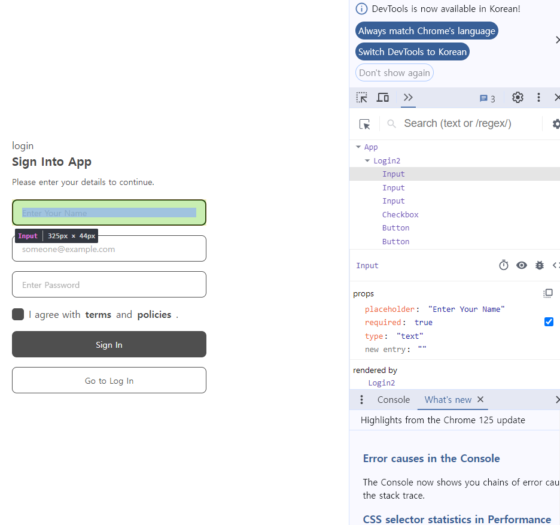
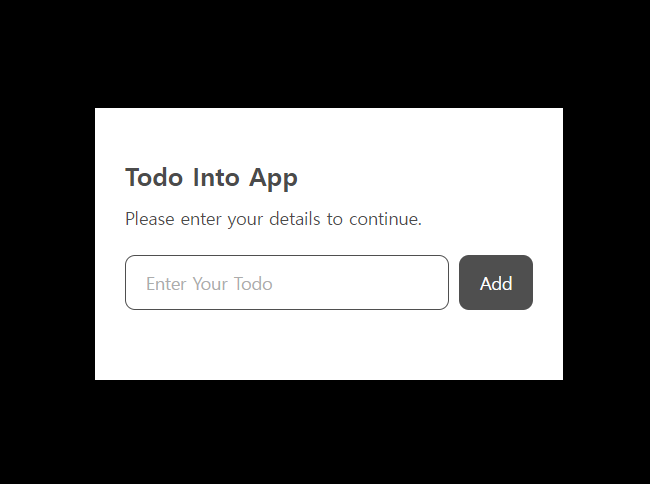
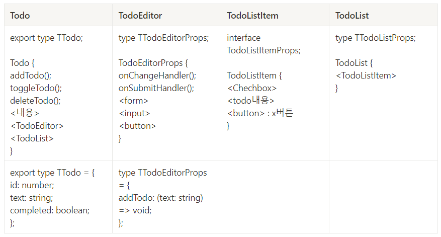

# 프로젝트 캠프 7일차

[🔊낯익은 거리들이 거울처럼 반짝여도](https://www.youtube.com/watch?v=74_yqNBhQbA&list=RD74_yqNBhQbA)

## 실습 로그인 화면 만들기 🎮

```tsx
type TButtonProps = React.ComponentProps<"button"> & {
  style?: string;
  children: React.ReactNode;
};

const Button = (props: TButtonProps) => {
  const { children, style = "bg-[#4f4f4f] text-white", ...restProps } = props;

  return (
    <div>
      <button
        {...restProps}
        className={`w-[325px] h-11 rounded-lg text-sm ${style}`}
      >
        {children}
      </button>
    </div>
  );
};

export default Button;
```

ㅤ

### \<em>태그

```tsx
<em className="not-italic font-bold">terms</em> and{" "}
                <em className="not-italic font-bold">policies</em>.
```

`<em>` 태그는 HTML에서 의미적으로 강조된 텍스트를 나타내는 태그입니다. "emphasized"의 줄임말로, 해당 텍스트를 강조하여 표시합니다. 기본적으로 이태릭체로 표시되지만, 스타일을 추가하여 텍스트를 원하는대로 변경할 수 있습니다.

여기서는 `<em>` 태그에 `not-italic`과 `font-bold` 클래스가 추가되어 있습니다. 이것은 아마도 텍스트를 기울임체에서 일반체로 변경하고, 글꼴을 볼드체로 만들었습니다.

- `not-italic`: 해당 텍스트를 기울임체로 표시하지 않도록 설정합니다.
- `font-bold`: 해당 텍스트를 볼드체로 설정합니다.

---

### 캡처도구

디버깅하는 방법 : 개발자도구의 components 이용하기



```tsx
e.preventDefault();
```

```tsx
const uuid = useId(); // 식별자를 위한 id
```

---

### 상태 업데이트 🎮

React에서 `setCount`를 호출해도 `count`가 한 번에 1씩만 증가하는 이유는 상태 업데이트가 비동기적으로 수행되고, **여러 상태 업데이트가 하나의 렌더링 주기에 배치**되기 때문입니다. React의 상태 업데이트 메커니즘은 성능 최적화를 위해 여러 상태 변경을 배치하여 한 번의 렌더링 주기 동안 처리합니다.

리액트에서는 가상돔을 이용해 디핑하고 배치 업데이트를 하는 과정을 거치는데 이 때 여러 setCount들이 비동기적으로 발생하며 한번의 렌더링 과정에서 배치되기 때문에 1씩 늘어난다.

중복되는 명령어는 하나의 변화로 간주되어, 실제로는 최종 값으로만 업데이트

```tsx
import { useState } from "react";
import "./App.css";

function App() {
  const [count, setCount] = useState(0);
  const onClickhandler = () => {
    setCount(count + 1);
    setCount(count + 1);
    setCount(count + 1);
  };

  return (
    <>
      <div>
        <h1>COUNT : {count}</h1>
        <button onClick={onClickhandler}>click</button>
      </div>
    </>
  );
}

export default App;
```

`setCount` 해도 1씩만 증가함. 왜?

### ❇️ 해결방법

내부의 콜백 함수 이용하기

```tsx
const onClickhandler = () => {
    setCount((prevCount) => {
      console.log(prevCount);
      return prevCount + 1;
    });

    setCount((prevCount) => {
      console.log(prevCount);
      return prevCount + 1;
    });

    setCount((prevCount) => {
      console.log(prevCount);
      return prevCount + 1;
    });
```

이전값을 참조해서 값을 업데이트 해야 하는 경우 콜백함수 이용하기

아니면 새로운 값을 바로 전달

ㅤ

## 컴포넌트의 렌더링🎮

루트 컴포넌트=App 컴포넌트가 처음 렌더링될 때 모든 하위 컴포넌트도 함께 렌더링된다.

재렌더링은 컴포넌트의 상태state나 속성props가 변경되면 발생한다. 이 때 해당 컴포넌트의 하위 컴포넌트들도 다시 렌더링 된다. 즉 `상위 컴포넌트가 렌더링되면 하위 컴포넌트들도 다시 렌더링된다.`

ㅤ

그러므로 상태state는 컴포넌트의 최하위에서 관리하는 것이 렌더링을 최소화할 수 있다. 컴포넌트의 구조 짤 때 주의하기!

### ❇️ 불필요한 재렌더링 방지

`React.memo` 를 사용해 방지할 수 있다

## 메모이제이션🎮

### ❇️ 컴포넌트를 메모이제이션

```tsx
import React from "react";

const Display = ({ count }: { count: number }) => {
  console.log("display rendered");

  return (
    <div>
      <h1>COUNT : {count}</h1>
    </div>
  );
};

export default React.memo(Display);
```

`Display` 의 값(`count`)이 바뀌지 않는 이상 재렌더링되지 않는다.

### ❇️ 함수의 메모이제이션

```tsx
import React from "react";

type TButtonProps = {
  onClickhandler: () => void;
};

const Button = ({ onClickhandler }: TButtonProps) => {
  console.log("button rendered");
  return (
    <div>
      <button onClick={onClickhandler}>click</button>
    </div>
  );
};

export default React.memo(Button);
// App.tsx
<Button onClickhandler={onClickhandler} />;
```

> 컴포넌트에 memo를 써도 버튼이 재렌더링된다. 왜?

`React.memo`는 컴포넌트의 props가 변경되지 않았을 때에만 재렌더링을 방지합니다. 그러나 부모 컴포넌트가 렌더링될 때마다 자식 컴포넌트에 새로운 콜백 함수를 전달하는 경우, 자식 컴포넌트는 새로운 콜백 함수를 받게 되므로 재렌더링될 수 있습니다.

여기서 `onClickhandler`가 부모 컴포넌트에서 생성된 콜백 함수이고, 이 콜백 함수가 부모 컴포넌트의 상태나 프롭스에 의존하는 경우, 부모 컴포넌트가 렌더링될 때마다 새로운 콜백 함수가 생성되어 자식 컴포넌트도 새로운 props를 받게 됩니다. 이로 인해 `React.memo`가 적용되어 있더라도 자식 컴포넌트가 재렌더링된다.

_해결_

최적화를 위해서는 부모 컴포넌트에서 콜백 함수가 아닌 메모이제이션된 콜백 함수를 전달해야 한다.

```tsx
const onClickhandler = useCallback(() => {
  setCount(count + 1);
}, []);
```

`useCallback` 사용. 두번째 인자로 []를 준다. 재렌더링할 때도 함수 다시 만들지 말고 재활용해라. 그러니까 App 컴포넌트는 루트 컴포넌트이므로 매번 재렌더링되는데 이 때 해당 함수는 제외된다. (+컴포넌트의 메모이제이션도 함께 사용해야 함)

_또문제_

헉 근데 버튼 한번 누르니까 더 이상 증가 안됨

클릭되기 이전의 상태>0 값을 기억하고 함수를 다시 만들지 않기 때문이다.

_해결_

```tsx
const onClickhandler = useCallback(() => {
  setCount(count + 1);
}, [count]);
```

**두번째 인자로 종속성 배열을 전달**하여 해당 배열에 포함된 값이 변경될 때에만 새로운 콜백 함수가 생성되도록 설정한다. 이러면 종속성 배열에 있는 값이 변경되면 다시 값을 참조한다. 해

_해결2_

```tsx
const onClickhandler = useCallback(() => {
  setCount((prev) => prev + 1);
}, []);
```

콜백함수로 받아 이전 상태값을 참조하는 방법도 가능하다.

---

```tsx
import React, { useCallback, useState } from "react";
import SubInput from "./components/SubInput";

const App = () => {
  const userInitialized = ["jack", "john", "jane", "smith"];
  const [user, setUser] = useState(userInitialized);

  const onChangeHandler = useCallback((text: string) => {
    const filteredUser = userInitialized.filter((item) => item.includes(text));
    setUser(filteredUser);
  }, []);

  const shuffle = () => {
    setUser([...user].sort(() => Math.random() - 0.5));
  };

  return (
    <div>
      <h1>App component</h1>
      <SubInput onChangeHandler={onChangeHandler} />
      <button onClick={shuffle}>Shuffle</button>
      <ul>
        {user.map((item, index) => (
          <li key={index}>{item}</li>
        ))}
      </ul>
    </div>
  );
};

export default App;
```

.

```tsx
import React, { ChangeEvent } from "react";

const SubInput = ({
  onChangeHandler,
}: {
  onChangeHandler: (text: string) => void;
}) => {
  console.log("input render");
  const handleChange = (e: ChangeEvent<HTMLInputElement>) => {
    onChangeHandler(e.target.value);
  };

  return (
    <div>
      <input type="text" onChange={handleChange}></input>
    </div>
  );
};

export default React.memo(SubInput);
```

.

```tsx
const onChangeHandler = useCallback((text: string) => {
  // 셔플이나 외부 상태 영향받지 않음, 최초 상태 유지, 외부영향 받고 싶으면 종속성 배열 추가해야함
  console.log(user[0]);
  const filteredUser = userInitialized.filter((item) => item.includes(text));
  setUser(filteredUser);
}, []);
```

`userInitialized` 배열을 필터링하고, 그 결과를 `filteredUser`에 저장한 다음, 이를 `setUser` 함수를 사용하여 React 상태로 업데이트

- `filter()` 메서드는 주어진 함수에 따라 배열의 각 요소를 검사하고, 조건을 충족하는 요소로 이루어진 새로운 배열을 반환합니다.

콜백 함수\*`item => item.includes(text)`는 배열의 각 요소인 `item`을 받아들이고, 해당 `item`이 `text`를 포함하는지를 확인합니다. 이를 통해 `userInitialized` 배열에서 `text`를 포함하는 모든 요소를 찾아냅니다.

그 후, 이렇게 필터링된 결과 배열을 `filteredUser` 변수에 할당합니다.

```tsx
<ul>
  {user.map((item, index) => (
    <li key={index}>{item}</li>
  ))}
</ul>
```

### ❇️ useMemo 사용예제

```jsx
export const initialItems = new Array(29_999_999).fill(0).map((_, i) => {
  return {
    id: i,
    selected: i === 29_999_998,
  };
});
```

```jsx
import { useMemo, useState } from "react";
import { initialItems } from "./lib/utils";
const App = () => {
  const [count, setCount] = useState(0);

  // 불필요한 연산을 만들어준 것
  // 3000만개의 배열 데이터를 렌더링 마다 재생성하고 있음
  const [items] = useState(initialItems);

  const selectItems = useMemo(() => items.find((item) => item.selected), []);

  return (
    <>
      <h1>Count: {count}</h1>
      <button onClick={() => setCount((prevCount) => prevCount + 1)}>
        증가
      </button>
      <p>{selectItems?.id}</p>
    </>
  );
};
export default App;
```

`useMemo`를 사용하여 `items` 배열을 캐싱하고 있습니다. `useMemo`의 두 번째 매개변수로 전달된 배열이 변경되지 않는 한, `useMemo`는 이전에 계산된 값을 반환합니다. 따라서 `items` 배열이 변경되지 않는 한 `selectItems`도 이전에 계산된 값을 재사용하여 렌더링될 때마다 다시 계산되지 않습니다. 이렇게 함으로써 불필요한 연산을 최소화하고 성능을 향상시킬 수 있습니다.

### ❇️ 실습 Todo




---

본 후기는 본 후기는 [유데미x스나이퍼팩토리] 프로젝트 캠프 : Next.js 1기 과정(B-log) 리뷰로 작성 되었습니다.
