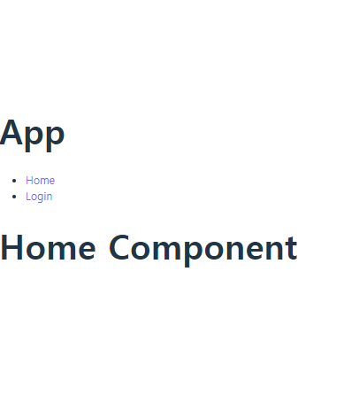
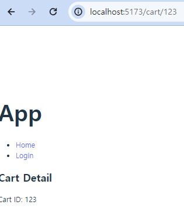

# 프로젝트 캠프 9일차

[🔊마치 책을 넘기는 듯한 마음으로](https://www.youtube.com/watch?v=JmUeLS_RBvA)

---

### ❇️ HTTP Methods

HTTP의 P는 프로토콜의 줄임말로 웹 브라우저가 서버와 통신하기 위한 프로토콜이다. 대표적으로 GET, POST, PUT, PATCH 등이 있으며 해당 메서드들을 이용해 서버에게 특정 행동을 요청한다.

> 추가적으로 HTTP는 내부적으로 TCP/IP 기반이며 TCP/IP는 UDP와 비교해 3-way 핸드쉐이크 과정을 거치며 데이터가 제대로 전송되었는지 확인하는 싱크 SYN, ACK 과정을 거친다. 즉 가장 큰 특징은 신뢰성 있는 연결이라는 점이다.
> 그래서 기본적으로 UDP보다 신뢰성 있는 연결을 확인하는 과정에서 시간이 소요된다. UDP는 더 빠르다는 말이다. 그러나 UDP는 신뢰성이 부족하다는 거고 장단점이 굉장히 명확하다.
> QUIC는 Zero RTT가 핵심인 UDP 기반의 프로토콜로 속도에서 엄청난 강점이 있고 암호화된 전송을 통해 신뢰성 있는 연결 부분도 어느 정도 해결한 프로토콜이다.

각 메서드 성격에 맞는 API 구현이 필요하다.

- GET : 데이터를 요청하기 위해 사용되는 메소드 - 보안취약, 탈취 쉬움
- POST : 데이터를 생성하기 위해 사용되는 메소드 - 보안상 안정성이 높다.
- PUT : 데이터를 업데이트하기 위해 사용되는 메소드 - 데이터 전체적으로 업데이트
- PATCH : 데이터 업데이트 - 데이터 일부분만 업데이트
- DELETE : 데이터 삭제하기 위해 사용되는 메소드

각 HTTP 메서드는 특정한 작업을 수행하기 위해 사용되며, 이러한 메서드를 이용하여 API를 설계할 때는 해당 작업의 목적과 특성에 맞게 구현해야 합니다. 이러한 사회적 합의된 API 설계 방식 중 하나가 REST(Representational State Transfer) API입니다. REST API는 웹 서비스를 위한 일반적인 설계 원칙을 제공하며, HTTP 메서드를 이용하여 자원을 조작합니다.

## Express 서버 🐦

> server/server.js

1. 간단한 RESTful API 생성하기

```tsx
npm init -y
npm install express cors nodemon
npx nodemon server.js // 서버 실행
```

노드몬을 이용하면 서버를 재시작할 필요없이 실시간으로 코드 반영을 확인할 수 있다.

```tsx
const express = require("express");
const cors = require("cors");
const bodyParser = require("body-parser");
const { v4: uuidv4 } = require("uuid");

const app = express();
const port = 4000;

// 미들웨어 설정
app.use(bodyParser.json());
app.use(cors());

let todos = [];

app.get("/", (req, res) => {
  res.send("Hello Snifer!");
});

app.get("/todos", (req, res) => {
  res.json(todos);
});

app.post("/todos", (req, res) => {
  const { text } = req.body;
  const newTodo = {
    id: uuidv4(),
    text,
    completed: false,
  };
  todos.push(newTodo);
  res.status(200).json(newTodo);
});

app.delete("/todos/:id", (req, res) => {
  const { id } = req.params;
  todos = todos.filter((todo) => todo.id !== id);
  res.status(200).send();
});

// 완료 상태로 업데이트
app.patch("/todos/:id", (req, res) => {
  const { id } = req.params;
  const findTodo = todos.find((todo) => todo.id === id);

  if (!findTodo) {
    res.status(404).send("Todo Not Found");
    return;
  }

  todos = todos.map((todo) =>
    todo.id === id ? { ...todo, completed: !todo.completed } : todo
  );
  res.status(200).json(todos.find((todo) => todo.id === id));
});

app.listen(port, () => {
  console.log(`Example app listening on port ${port}`);
});
```

VS코드의 thunder client를 사용해 명령어들이 정상 작동하는지 확인할 수 있다.

일종의 백엔드 서버 구축이 완료. 할일 앱에 적용해보기

## 리액트에서 데이터 fetch/axios 🐦

기본적으로 todos 배열을 `useState`를 이용해 관리한다.

+. Promise 객체

비동기 작업을 다루는 객체이다. 특정 작업이 완료될 때까지 기다리지 않고 다음 작업을 수행한다. 대기, 이행, 거부의 세 가지 상태를 가지며, then과 catch 메서드로 성공과 실패를 처리한다.

+. async/await

비동기 코드를 간결하고 직관적이게 작성 가능하다. 이전에는 promise와 콜백 함수를 사용해 비동기 작업을 처리했지만 콜백 지옥의 문제가 생겼다. 이를 해결한다. async로 작성된 함수는 항상 promise를 리턴하며 내부에 await 키워드를 사용해 비동기 작업의 완료를 기다릴 수 있다.

### 1. fetch

`Fetch API` 는 브라우저 내장 API로 `Promise` 기반으로 작동한다. 응답이 Promise 객체로 돌아오므로 해당 response를 json 형태로 변환하고 then을 사용해 json 형태의 응답에서 data만을 받아 setTodos에 업데이트한다.

```tsx
const fetchData = () => {
  fetch("http://localhost:4000/todos")
    .then((response) => response.json())
    .then((data) => {
      console.log(data);
      setTodos(data);
    })
    .catch((error) => {
      console.log("error");
      console.log(error);
    });
};
```

### 2. fetch Async

`async/await` 를 사용해 then 상태를 생략할 수 있다. async 함수는 항상 promise를 반환하고 await은 promise가 해결될 때까지 기다리고 그 결과 값을 리턴한다.

```tsx
const fetchDataAsync = async () => {
  try {
    const response = await fetch("http://localhost:4000/todos");
    const data = await response.json();
    setTodos(data);
  } catch (error) {
    console.log(error);
  }
};
```

### 3. Axios

Axios는 외부 라이브러리로 promise 기반이며 위의 방법들보다 더 간결하고 많은 기능을 사용할 수 있다. 자동으로 json 데이터를 직렬화/역직렬화한다.

+. 직렬화 역직렬화는 데이터를 다른 형식으로 변환하는 프로세스이다. 직렬화는 보통 객체나 데이터 구조를 텍스트 형식처럼 다른 형식으로 바꾸는 것이다.

```tsx
const axiosGet = () => {
  axios
    .get("http://localhost:4000/todos")
    .then((response) => {
      console.log(response);
      setTodos(response.data);
    })
    .catch((error) => {
      console.log(error);
    });
};
```

### 4. Axios Async

`async/await` 를 사용하면 axios 요청을 처리하면 코드가 간결해진다.

```tsx
const axiosAsyncGet = async () => {
  try {
    const response = await axios.get("http://localhost:4000/todos");
    setTodos(response.data); // 이미 json으로 변환된 파일 리턴함
  } catch (error) {
    console.log(error);
  }
};
```

> axios와 fetch 중 데이터를 처리할 때 어떤 방법이 유용한가?

axios는 promise 기반의 외부 라이브러리이므로 fetch와 비교해 추가적인 설치가 필요한 단점이 있다. 그러나 간결하고 가독성 좋은 코드와 다양한 기능을 사용하는 점에서 장점이 있다. fetch도 promise 기반의 api이기 때문에 async/await와 함께 쓴다면 충분히 메리트가 있다.

## useEffect 🐦

`useEffect` 는 사이드 이펙트=컴포넌트 외부에 있는 데이터를 읽거나 수정하는 작업을 수행할 수 있도록 하는 hook이다.

```tsx
useEffect(() => {
  // 부수 효과를 수행하는 코드
  return () => {
    // 정리(clean-up) 코드 (선택적)
  };
}, [dependencies]);
```

`첫 번째 매개변수`로 전달되는 함수는 데이터를 처리하는 코드를 포함한다. 해당 함수는 컴포넌트가 렌더링될 때마다 실행된다. `두 번째 매개변수`로 전달되는 배열의 값이 변경될 때마다 첫 번째 매개변수의 함수가 실행된다. 빈 배열을 전달하면 매 렌더링마다 실행된다. `정리코드`는 리턴 뒤에 작성되는 코드로 컴포넌트가 언마운트되거나 업데이트되기 직전에 실행되는 코드이다. 주로 데이터 상태를 초기화한다.

+. 마운트는 컴포넌트가 DOM에 추가되는 과정으로 언마운트는 컴포넌트가 삭제되는 시점이다. 생명주기의 과정이다.

- useEffect는 콜백 함수 내부에서 async를 사용할 수 없는데 사용하기 위해서는 내부에 별도의 함수를 정의해서 사용해야 한다.
- useEffect 내부에서 병렬 처리를 위해 여러 비동기 작업을 동시에 실행하고 기다릴 수 있다.

```tsx
useEffect(() => {
  const fetchData = async () => {
    try {
      const response = await fetch("https://api.example.com/data");
      const data = await response.json();
      setData(data);
    } catch (error) {
      console.error("Error fetching data:", error);
    }
  };

  fetchData(); // 비동기 함수 호출
  return () => {
    // 정리함수 비움
  };
}, []); // 의존성 배열이 비어 있으므로 컴포넌트가 마운트될 때만 실행
```

### ❇️ todo에 axios, useEffect 적용해서 데이터 처리하기

```tsx
const getDatas = async () => {
  const res = await axios("http://localhost:4000/todos");
  setTodos(res.data);
};
```

나중에 복습하기 = todo_api 파일로 직접 구현하기

## ZUSTAND 🐦

zustand는 리액트 상태 관리를 위한 라이브러리도 Redux와 같은 다른 상태 관리 라이브러리와 비교해 더 간단하고 직관적이다. 매우 간단한 api를 제공한다.

단일 스토어 패턴을 사용해 상태를 관리하는데 전역 상태를 하나의 객체에 저장하고 필요한 컴포넌트에서 import해 사용한다. 액션은 상태 객체에 변경을 줄 수 있는 함수이다. 상태 객체의 메서드로 액션이 정의된다.

```tsx
npm install zustand
```

프로젝트에 설치한다.

```tsx
// src/store.js
// 타입스크립트는 타입 정의 위한 인터페이스나 type 필요
import create from "zustand";

// Zustand 스토어 생성
const useStore = create((set) => ({
  // 인자로 set을 받음
  count: 0,
  increment: () => set((state) => ({ count: state.count + 1 })),
  decrement: () => set((state) => ({ count: state.count - 1 })),
}));

export default useStore;
```

생성된 스토어의 상태는 count이고 액션으로 increment와 decrement가 존재한다.

```tsx
// src/App.js
import React from "react";
import useStore from "./store";

function App() {
  const count = useStore((state) => state.count);
  const increment = useStore((state) => state.increment);
  const decrement = useStore((state) => state.decrement);
  return (
    <div>
      <h1>Counter</h1>
      <p>Count: {count}</p>
      <button onClick={increment}>Increment</button>
      <button onClick={decrement}>Decrement</button>
    </div>
  );
}
export default App;
```

필요한 컴포넌트에서 import해서 전역 상태를 사용할 수 있다.

+.

```tsx
import { useCountStore } from "../stores/countStore";

const IncrementBtn = () => {
  const increment = useCountStore((state) => state.increment);
  return (
    <>
      <button onClick={increment}>증가(increment)</button>
    </>
  );
};
export default IncrementBtn;
```

---

## 라우터 🐦

라우터는 웹에서 URL 경로를 컴포넌트와 매칭시키는 역할을 하는 기능이다. 사용자가 특정 URL에 접근할 때, 해당 URL에 맞는 페이지 또는 컴포넌트를 보여줄 수 있다.

웹에서 어떤 버튼을 누르면 자동으로 해당 URL로 페이지 전환되면서 이동할 때 == 이런 페이지 전환을 핸들링해주는 것이 `Router`이다.

주로 `SPA` 단일 페이지 앱에서 사용되는데 SPA는 최초 로딩 후 전체 페이지를 다시 로드하지 않고 컴포넌트를 이용해 부분적으로 사용자와의 상호작용(버튼 클릭 등)을 처리하기 때문에 이 때 라우터를 이용해 사용자와의 interaction을 처리한다. 페이지 전체를 다시 로드하지 않으므로 네비게이션 속도가 빠르고 사용자가 페이지를 새로고침하지 않아도 특정 URL로 이동 가능하다.

### 1. 세팅

리액트에서 라우터 사용하기

```tsx
npm install react-router-dom
```

### 2.

라우팅은 크게 `해시 라우터` 와 `브라우저 라우터` 방식이 있는데 해시 라우터는 URL에 #을 붙여서 구성되는 것이고 브라우저 라우터는 우리가 흔히 사용하는 슬래시(/)를 사용하는 것이다.

---

### 🚨 issue : Uncaught Error: useRoutes() may be used only in the context of a <Router> component.

`BrowserRouter` 로 감싸야 한다.

```tsx
// App.tsx
import { BrowserRouter as Router, Route, Routes } from "react-router-dom";
```

main.tsx에서 `BrowerRouter` 로 감싸주는 것도 정상 동작한다.

```tsx
import React from "react";
import ReactDOM from "react-dom/client";
import { BrowserRouter } from "react-router-dom";

import App from "./App.tsx";
import "./index.css";

ReactDOM.createRoot(document.getElementById("root")!).render(
  <React.StrictMode>
    <BrowserRouter>
      <App />
    </BrowserRouter>
  </React.StrictMode>
);
```

---

### 2-1. 일반 라우터 세팅



```tsx
import { Link, Route, Routes } from "react-router-dom";
import Home from "./pages/Home.tsx";
import Login from "./pages/Login.tsx";

const App = () => {
  return (
    <>
      <h1>App</h1>
      <nav>
        <ul>
          <li>
            <Link to="/">Home</Link>
          </li>
          <li>
            <Link to="/login">Login</Link>
          </li>
        </ul>
      </nav>
      <Routes>
        <Route path="/" element={<Home />} />
        <Route path="/login" element={<Login />} />
      </Routes>
    </>
  );
};

export default App;
```

네비게이션 태그는 단순히 시맨틱 HTML을 위함 (없어도 기능상 문제 없음)

> 시맨틱 HTML은 의미론적인 태그를 사용해 문서의 구조와 내용 이해를 명확하게 나타내기 위해 사용

`Routes` 컴포넌트는 URL의 경로와 매칭되는 컴포넌트를 렌더링해주는 일종의 창구다. 사용자가 링크를 클릭하거나 직접 URL을 입력하면 `Routes` 컴포넌트에서 인식하고 해당하는 컴포넌트를 렌더링해 웹페이지에 보여준다.

### 2-2. 동적 라우터 세팅

`react-router-dom` 에서 `useParams` 를 사용해 동적 라우팅 설정을 할 수 있다. 해당 훅은 URL 파라미터를 처리하는 컴포넌트이다.



```tsx
// App.tsx
<Route path="/Cart/:id" element={<CartDetail />} />

// CartDetail.tsx
import { useParams } from "react-router-dom";

const CartDetail = () => {
  const { id } = useParams();
  console.log(id);

  return (
    <div>
      <h2>Cart Detail</h2>
      <p>Cart ID: {id}</p> {/* 동적 파라미터 값을 출력 */}
    </div>
...
```

`useParams` 를 이용해 사용자가 직접 URL에 입력한 값을 동적으로 받아 처리할 수 있다.

### 2-3. 라우터 6.4 새로운 문법 이용하기

```tsx
import React from "react";
import ReactDOM from "react-dom/client";
import { RouterProvider } from "react-router-dom";
import { router } from "./router/router";

ReactDOM.createRoot(document.getElementById("root")!).render(
  <React.StrictMode>
    <RouterProvider router={router} />
  </React.StrictMode>
);
```

`RouterProvider` 컴포넌트는 라우터를 제공하는 역할을 한다. 해당 컴포넌트로 전달된 prop 라우터 객체를 사용해 전체적인 라우팅을 설정한다. `router` 컴포넌트를 따로 작성해 경로와 요소에 대한 내용을 집약적으로 정리할 수 있다.

```tsx
// router.tsx
export const router = createBrowserRouter([
  {
    element: <DefaultLayout />,
    children: [
      {
        path: "/",
        element: <Home />,
      },
      {
        path: "/login",
        element: <Login />,
      },
      {
        path: "/register",
        element: <Register />,
      },
    ],
  },
```

```tsx
// DefaultLayout.tsx
import { Outlet } from "react-router-dom";
import Header from "../components/Header";
import Footer from "../components/Footer";
const DefaultLayout = () => {
  return (
    <>
      <Header />
      <Outlet />
      <Footer />
    </>
  );
};
export default DefaultLayout;
```

`layout` 을 element로 넘겨줘서 path의 레이아웃을 설정할 수 있다. 레이아웃 컴포넌트 안에 또 세부 구성 컴포넌트를 작성해 병합되어 웹페이지에 넘겨진다.

`Outlet` 컴포넌트는 라우터의 경로와 일치하는 하위 라우터를 렌더링한다. `DefaultLayout` 컴포넌트의 헤더와 푸터는 공통적으로 항상 들어가고 디폴트 레이아웃의 자식 컴포넌트(children)인 홈, 로그인, 레지스터 컴포넌트의 내용이 `Outlet` 컴포넌트에 들어가게 된다.

+.

```tsx
Array.filter(element => (조건))// 배열을 요소로 돌면서 조건에 따라 필터링해서 조건에 맞는 것만 남긴다.
Array.map((element, index) => (return)) // 배열을 요소로 돌면서 리턴으로 변환한다.
```

---

본 후기는 본 후기는 [유데미x스나이퍼팩토리] 프로젝트 캠프 : Next.js 1기 과정(B-log) 리뷰로 작성 되었습니다.
