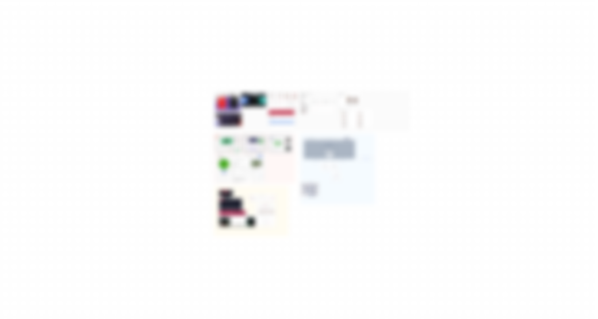

# 프로젝트 코스 Weekly 회고 1주차

## 진행과정

### 아이디어 브레인스토밍 > 1차 멘토링

프로젝트 초기에는 팀원들이 모여 아이디어를 자유롭게 제안하고 논의하는 시간을 가졌다. 다양한 아이디어가 제시되었으며, 각각의 아이디어가 실제 프로젝트에 적용되었을 때 어떤 문제점이 있을지, 사용자에게 유용할지, 여러 토의 과정을 거쳤다.

멘토님과의 첫 번째 멘토링 세션을 진행했다. 브레인스토밍한 내용을 말씀드리고 멘토님의 피드백을 바탕으로 프로젝트를 점점 구체화.

### 팀 규칙, 코딩 컨벤션 정의

활동 규칙과 코드 리뷰 규칙, git 커밋 메세지 등을 정리

### 사용자들 의견 모으기 > 구글폼 작성

프로젝트의 주요 기능을 정의하기 위해 잠재 사용자들의 의견을 모았다. 이를 통해 사용자들이 실제로 필요로 하는 기능을 파악하고, 프로젝트의 방향성을 설정하는데 큰 참고가 되었다.

### 아이디어 정리 및 기능별 필요 데이터 조사

브레인스토밍과 사용자 의견 수집 결과를 바탕으로 아이디어를 정리. 주요 기능을 선별하고, 이를 구현하기 위해 필요한 데이터를 조사했다.

### 1차 와이어프레임 완성 및 제출

보완 예정

## 후기

생각보다 고려해야 할 점이 정말 많았고 코드 치는 것보다 기획하고 설계하는 것이 정말 중요!

---

본 후기는 본 후기는 [유데미x스나이퍼팩토리] 프로젝트 캠프 : Next.js 1기 과정(B-log) 리뷰로 작성 되었습니다.
