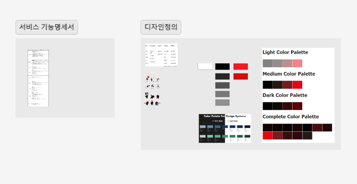

# 프로젝트 코스 Weekly 회고 2주차

이번 주는 2차 멘토링에서 받은 피드백을 바탕으로 기획 및 명세서를 수정하고, 피그마를 사용해 디자인 초안을 잡는 것에 중점을 두었다. 다음 주에는 멘토님과의 식사 및 디자인 초안에 대한 리뷰를 진행하고, 실제 개발을 위한 준비를 할 예정이다.

1. 2차 멘토링 후 피드백 정리

- 기능 명세서 정리 및 기획 수정
  - 2차 멘토링에서 받은 피드백을 세부적으로 분석하여 기능 명세서에 반영.
  - 기존 기획서에 포함되지 않았던 기능 추가 및 불필요한 기능 제거.
  - 기능 구현의 우선순위를 재설정하여 필수 기능부터 개발할 수 있도록 기획서 수정.
- 레퍼런스 추가 및 자료조사 보완

2. 피그마 디자인 초안 잡기

- 전체적인 구성 잡기
  - 주요 페이지와 기능에 대한 와이어프레임을 작성하여 초기 구조를 설계.
  - 사용자가 앱 또는 웹사이트를 이용하는 흐름을 시각적으로 표현한 사용자 흐름도 작성.
  - 색상, 타이포그래피, 아이콘 스타일 등 디자인의 기본 원칙을 수립.
- 역할분담

---

본 후기는 본 후기는 [유데미x스나이퍼팩토리] 프로젝트 캠프 : Next.js 1기 과정(B-log) 리뷰로 작성 되었습니다.
