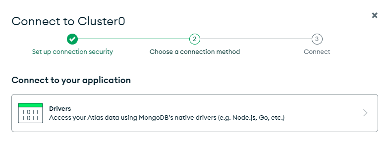
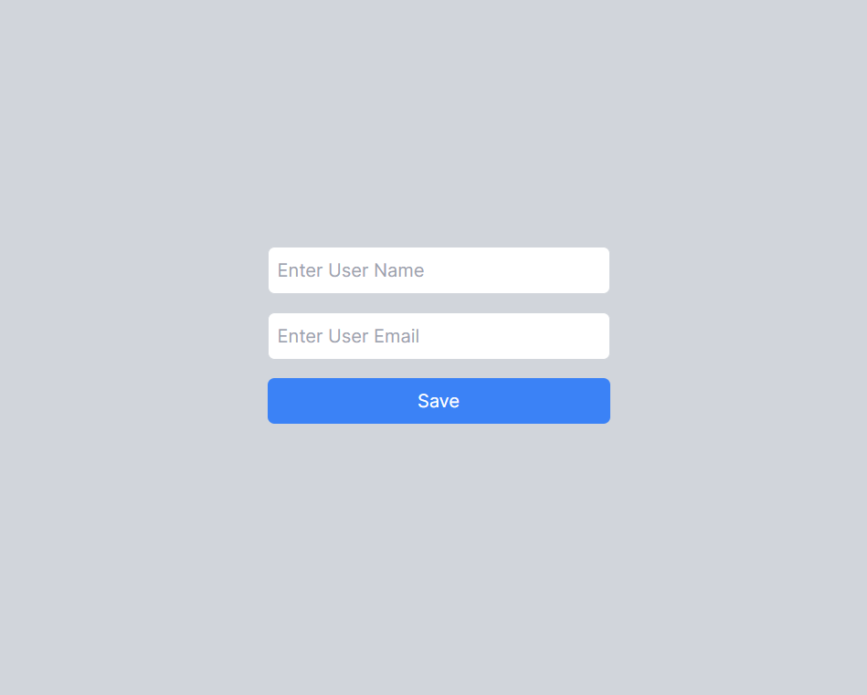
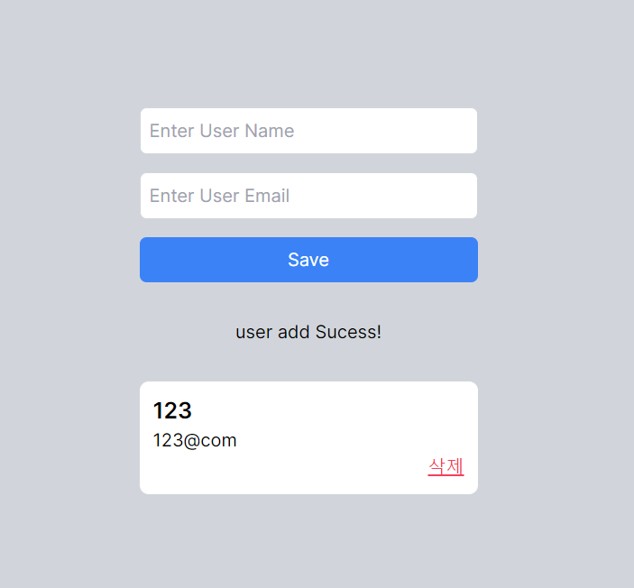

# Next.js에서 mongoDB 사용하기

# MongoDB 가입

무료 버전으로 가입하기

1. SECURITY > Database Access

   DB 접속용 아이디 비번 생성하기

2. SECURITY > Network Access

   IP Address를 0.0.0.0/0으로 하면 모든 IP를 허용한다.

## Clusters

1. 클러스터를 생성하고 `Connect` 클릭



2. `Drivers` 클릭해서 3. Add your connection string into your application code 부분을 copy

   <password> 부분에 자신의 비밀번호 입력

3. `Browse Collections` 에서 연결들을 확인할 수 있다.

## Next.js

1.

```jsx
npm install mongoose
```

2. .env 파일에 위에서 copy한 내용을 `MONGODB_URL` 로 assign

   ```jsx
   MONGODB_URL = copy한내용;
   // retryWrites 바로 앞에 /dbName 을 추가하면 이후 연결들을 해당 이름으로 관리함
   ```

3. lib/db.ts

   ```jsx
   // db.ts
   import mongoose from "mongoose";
   const connectDB = async () => {
     try {
       if (mongoose.connection.readyState >= 1) {
         console.log("Already connected to MongoDB");
         return;
       }
       await mongoose.connect(process.env.MONGODB_URL as string);
       console.log(`MongoDB Connected`);
     } catch (error) {
       console.error(`Error: ${error}`);
       process.exit(1);
     }
   };
   export default connectDB;
   ```

   이미 연결되어 있으면 콘솔에 출력. 이후 다른 곳에서 `connectDB` 로 db 연결 가능

4. lib/schema.ts

   ```jsx
   // schema.ts
   import mongoose from "mongoose";
   const userSchema = new mongoose.Schema(
     {
       email: {
         type: String,
         required: true,
       },
       name: {
         type: String,
         required: true,
       },
     },
     { timestamps: true }
   );
   export const User =
     mongoose.models.User || mongoose.model("User", userSchema);
   ```

   MongoDB에 `User` 라는 컬렉션을 만들고 각 문서(document)는 `email` 과 `name` 필드를 가진다. 파일명을 model.ts로 해도 ㅇㅇ 스키마로 모델을 만드는 코드.

5. lib/action.ts

   ```tsx
   "use server";
   import { revalidatePath } from "next/cache";
   import connectDB from "./db";
   import { User } from "./schema";

   // 회원 추가
   export async function addUser(prevState: string, formdata: FormData) {
     const name = formdata.get("name");
     const email = formdata.get("email");

     // mongodb connection
     connectDB();

     if (email === "" || name === "") {
       return "Please fill in the form.";
     }

     // mongodb Schema Query
     const user = new User({ name, email });
     await user.save();
     revalidatePath("/");
     return "user add Sucess!";
   }
   ```

   db에 연결하고 formdata로 사용자의 입력을 받아 저장 후 `revalidatePath` 로 페이지를 재생성한다. 새로고침과는 약간 다르다. 변경된 데이터베이스를 반영하기 위해 주로 사용된다. 페이지의 일부분만 업데이트된다. 새로고침은 전체 페이지가 새로 불러와진다.

# Next.js와 MongoDB를 이용한 로그인 APP

## API Endpoint

Next.js의 api 라우팅을 통해 db에서 데이터를 가져와 클라이언트에게 리턴하는 api 엔드포인트를 구현한 것이다.

app/api/users/route.ts

```jsx
import connectDB from "@/lib/db";
import { User } from "@/lib/schema";

export async function GET(request: Request) {
  connectDB();
  const users = await User.find();
  return Response.json(users);
}
```

서버 사이드에서 데이터베이스와 연결해 MongoDB에서 사용자 데이터를 가져오는 GET 요청을 처리한다. 조회된 사용자 데이터 users를 json 형식으로 response한다.

## 완성




